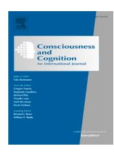
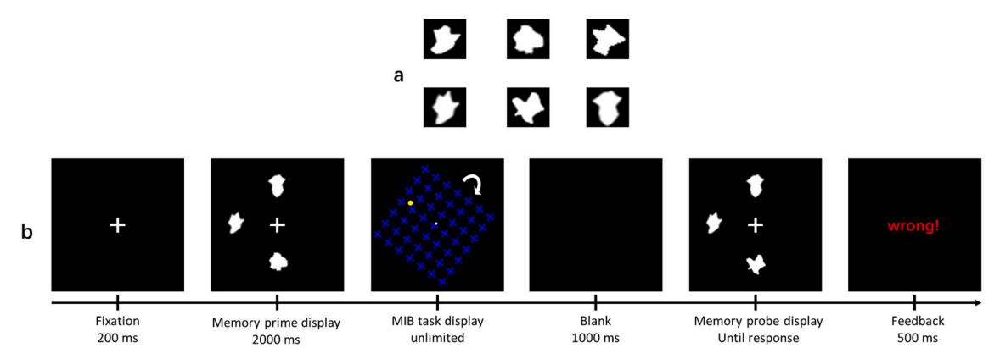
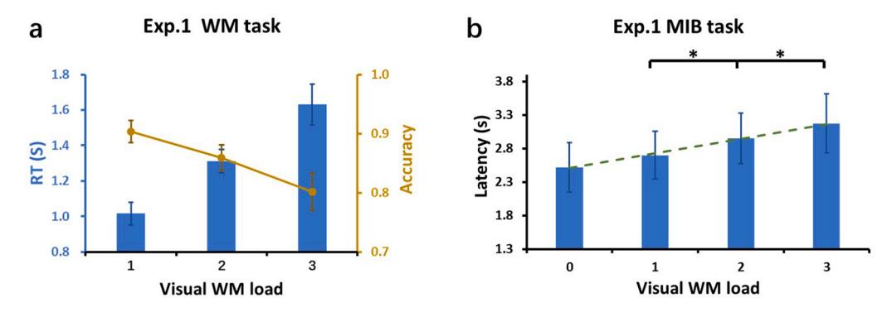
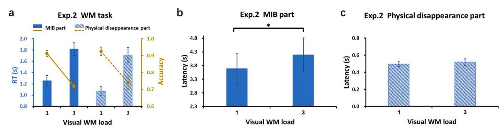
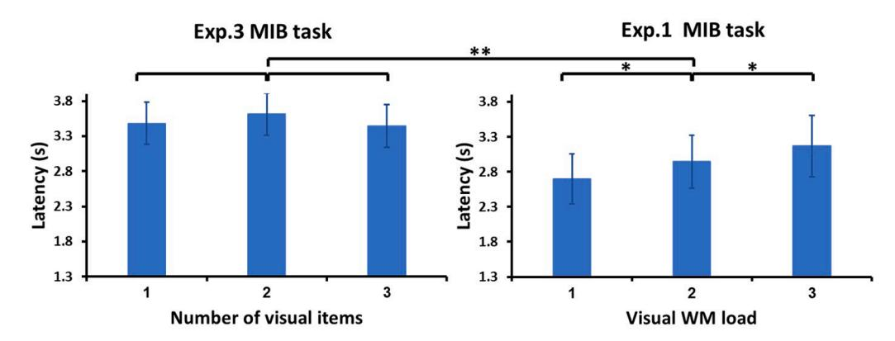

Contents lists available at ScienceDirect

# Consciousness and Cognition

journal homepage: www.elsevier.com/locate/concog

# The linear impact of visual working memory load on visual awareness: Evidence from motion-induced blindness

Jiahan Yu $^{a,b,1}$ , Yiling Zhou $^{b,1}$ , Yingtao Fu $^{b}$ , Ci Wang $^{b}$ , Jifan Zhou $^{b,*}$ , Mowei Shen $^{b,*}$ , Hui Chen $^{b,c,*}$ 

- a Department of Psychology, Suzhou University of Science and Technology, China
- b Department of Psychology and Behavioral Sciences, Zhejiang University, China
- c Department of Psychology, The Pennsylvania State University, USA

#### ARTICLE INFO

#### Keywords: Visual awareness Visual working memory load Motion-induced blindness

#### ABSTRACT

Despite the close relationship between visual working memory (VWM) and visual awareness, the question of how these two constructs interact with each other is still under debate. The current study aimed to further address this issue by investigating whether and how visual awareness is influenced by VWM load. In Experiment 1, participants were asked to perform a motion-induced blindness (MIB) task while simultaneously memorizing different numbers of items in VWM. The results indicated that the latency of MIB was prolonged gradually as the VWM load increased, revealing a linear trend in the modulation effect of VWM load on visual awareness. Experiments 2 and 3 tested the other potential explanations and validated the initial finding by confirming that VWM load was indeed responsible for the observed effect on visual awareness. These findings have important implications for a better understanding of the relationship between VWM and visual awareness

#### 1. Introduction

It is well known that working memory (WM) and conscious awareness are highly related. WM has traditionally been believed to operate only for consciously accessible information (Baars & Franklin, 2003; Stein et al., 2016; Trübutschek et al., 2019; but see Soto et al., 2011, for non-conscious WM) and consciousness has been regarded as "The Remembered Present" (Edelman, 1989). The global workspace theory, one of the most influential theories in cognitive psychology and neuroscience, even treats consciousness as a kind of momentary WM (Baars, 1988; Dehaene et al., 1998). A substantial number of behavioral studies have shown that WM and awareness have many similar characteristics, including a highly limited capacity (Cowan, 2001; Crick & Koch, 1990; Lamme, 2003; Luck & Vogel, 1997). Numerous neuroscientific studies have shown an overlap between WM and consciousness at the neural level; both are associated with the prefrontal parietal network (Naghavi & Nyberg, 2005). Recently, many studies have focused on the relationship between different components/subsystems (visuospatial sketchpad, phonological loop and central executive, Baddeley, 2003) of WM and awareness (De Loof, et al., 2015; Maniscalco & Lau, 2015; Koivisto et al., 2018; Konstantinou & Lavie, 2013). Compared to the relatively consistent supporting evidence for the close connection between the phonological loop, central executive of WM and

\* Corresponding authors at: Department of Psychology and Behavioral Sciences, Zhejiang University, Xixi Campus, 148 Tianmushan Road, Hangzhou 310007, China.

E-mail addresses: jifanzhou@zju.edu.cn (J. Zhou), mwshen@zju.edu.cn (M. Shen), chenhui@zju.edu.cn (H. Chen).

&lt;sup>1 Jiahan Yu and Yiling Zhou contributed equally to this work.

awareness [\(De Loof et al., 2013, 2015; Maniscalco](#page-8-0) & Lau, 2015; Koivisto et al., 2018), the relationship between the visuospatial sketchpad of WM and awareness is more controversial ([De Loof et al., 2015; Koivisto et al., 2018; Konstantinou et al., 2012; Kon](#page-8-0)stantinou & [Lavie, 2013\)](#page-8-0). Thus, the current study focused on further examining the relationship between visual working memory (VWM) and visual awareness.

Despite the close relationship between VWM and visual awareness, the question of how these constructs interact with each other has rarely been empirically explored until recently. An increasing number of studies have been conducted to elucidate their relationship by investigating how visual awareness is modulated by VWM content. For instance, an early study revealed that parietal patients with visual extinction (a neurological disorder involving difficulty in consciously perceiving contralesional stimuli when presented simultaneously with an ipsilesional stimulus; [Vuilleumier](#page-8-0) & Rafal, 2000) showed enhanced awareness of the contralesional targets that were congruent with the items being maintained in VWM (Soto & [Humphreys, 2006](#page-8-0)). Numerous subsequent studies with normal participants have observed similar boost effects of VWM contents on visual awareness by showing that holding an item in VWM can facilitate the processing of WM-congruent stimuli, even when the stimuli are suppressed from awareness (Chen & [Scholl, 2013;](#page-8-0) [Ding et al., 2021; Gayet et al., 2013; Liu et al., 2016; van Moorselaar et al., 2018](#page-8-0)). Furthermore, research on inattentional blindness (an inability to notice an unexpected stimulus when attention is engaged elsewhere; Mack & [Rock, 1998\)](#page-8-0) has also revealed that the probability of consciously perceiving an unexpected stimulus increased when the stimulus was either visually or semantically congruent with the contents held in VWM (Koivisto & [Revonsuo, 2007; Most et al., 2005\)](#page-8-0).

Apart from the aforementioned VWM congruent effects, some other studies have indicated that visual awareness of information could also be influenced by VWM load, even though the contents held in VWM were completely irrelevant ([Konstantinou et al., 2012;](#page-8-0) [Konstantinou](#page-8-0) & Lavie, 2013). For example, in Konstantinou et al.'s study [\(2012](#page-8-0)), participants were asked to memorize one or six colored square(s). During the maintenance interval, a perceptual detection task was completed in which participants had to judge whether there was a grating with higher contrast. Results showed that when memorizing a greater number of colored squares, the detection sensitivity of the grating was reduced. Other studies reported opposite results in that the detection threshold was not influenced by the VWM load, although it was modulated by the executive WM load ([De Loof et al., 2015; Koivisto et al., 2018\)](#page-8-0). For example, the study by [De Loof and colleagues \(2015\)](#page-8-0) explored the relationship between visual consciousness and working memory, using a dual-task paradigm. Results indicated that visuospatial working memory impairs visual awareness, irrespective of the load of VWM while increasing executive load increased the effect on visual awareness threshold. Clearly, the question whether visual awareness could be influenced by VWM load is still under debate. Thus, the current study aimed to further clarify this issue.

Most of the above-mentioned studies manipulated stimulus intensity or visibility to obtain different levels of conscious awareness (consciousness and unconsciousness) and measured awareness by relying on participants' detection accuracy performance. As claimed by [Timmermans and Cleeremans \(2015\)](#page-8-0), one potential issue with this awareness measurement is that it might measure metacognitive acuity rather than awareness. Metacognitive acuity refers to the ability to accurately and effectively monitor and regulate one's own cognitive processes, such as evaluating whether a correct answer has been given ([Han, 2022\)](#page-8-0). Measuring metacognitive acuity alone is not sufficient to fully capture conscious awareness. The correlation between awareness and accuracy may not be causal, and unconscious factors can impact both measures. Therefore, it is necessary to use multiple approaches to better understand awareness, especially when different results yield. In this study, we adopted a different method in which the stimulus is kept constant while conscious awareness changes, allowing us to directly measure participants' conscious experience of the stimulus itself. Specifically, we adopted a motion-induced blindness (MIB) task [\(Bonneh et al., 2001; New](#page-7-0) & Scholl, 2008) that participants performed during the retention interval of a VWM task, while simultaneously manipulating the memory set size. MIB refers to a phenomenon where a highly salient and localized stimulus may disappear and reappear spontaneously from conscious awareness when it is presented together with a global moving pattern [\(Bonneh et al., 2001\)](#page-7-0). MIB is a useful tool for studying dynamic exploration of visual awareness, which does not require any sudden disruptions, attentional manipulations, or strict timing constraints as other paradigms (Mitroff & [Scholl, 2005](#page-8-0)). [Chen and Scholl \(2013\)](#page-8-0) once employed MIB task to examine the effect of VWM congruence in boosting awareness of invisible stimuli. They found that the target that was congruent with VWM was more prone to reappear initially, validating the effectiveness of the MIB paradigm in investigating the interaction between VWM and awareness.

Another issue that needs to be pointed out is that many previous studies have not systematically manipulated the level of VWM load2 , which makes it hard to further clarify how this modulation of VWM load operates on visual awareness. Therefore, the current study was designed not only to investigate whether VWM load could modulate visual awareness, but also to further address how visual awareness was influenced by VWM load.

#### **2. Experiment 1**

The first experiment sought to investigate whether and how VWM load modulates visual awareness by employing the MIB paradigm.

# *2.1. Method*

*Participants.* Sixteen Pennsylvania State University undergraduates completed Experiment 1 for course credits. All participants

2 The only exception is Koivisto et al., 2018′ s study in which they did manipulate the level of VWM load, but did not observe the modulation effect of VWM load on awareness.

reported normal or corrected-to-normal visual acuity. One additional participant completed the experiment but was excluded because his average accuracy of the VWM task across conditions was lower than 60%. The study was approved by the Institutional Review Board at Pennsylvania State University.

*Apparatus.* The stimuli were displayed on a 17 in CRT monitor with a resolution of 1024 × 768 pixels and a refresh rate of 75HZ. The animations were written in MATLAB using the PsychToolbox libraries (Brainard & [Vision, 1997; Pelli, 1997\)](#page-8-0). The viewing distance was fixed at 57 cm, using a chinrest. Participants responded using a computer keyboard.

*Stimuli.* Each trial contained a memory prime, MIB, and memory probe displays. The memory prime display contained a central fixation cross and a set of 0, 1, 2, or 3 different memory items, corresponding to the no-load, one-shape, two-shape, and three-shape VWM load conditions, respectively. These memory items were randomly chosen from a set of six complex, meaningless shapes ([Fig. 1a](#page-3-0), 1.83◦ × 1.83◦ visual angle). Each shape was presented at one of the four corners of an invisible diamond centered on the screen, with each corner placed 4.18◦ from the central fixation. The memory probe display was set to be either identical to the memory prime or different from the memory prime by changing one of the shapes. The MIB display consisted of a central white fixation point (a 0.38◦ circle, drawn with a stroke of 1 pixel), a uniform array of 7 × 7 blue (RGB:50/50/255) crosses (17.62◦ × 17.62◦) that was centrally positioned and continuously rotated clockwise at 240◦/s, and a bright yellow target object disc (0.50◦) appearing on the upper-left quadrant of the display (2.91◦ from the fixation point).

*Procedure and Design.* As shown in [Fig. 1b](#page-3-0), each trial began with a 200 ms fixation cross, which was followed by the memory prime display for 2 s. Participants were required to remember all the shapes throughout the trial. The offset of the memory prime display was followed by the MIB display, in which participants were instructed to fixate centrally while monitoring the disappearance of the yellow target circle. They were required to press and hold an assigned key as soon as the target circle disappeared and release the key whenever the target reappeared. Once the key was released, a blank screen appeared for 1 s, which was replaced by the memory probe display until participants responded to the WM task. That is to say, they were asked to judge whether the shapes in the memory probe display matched those in the memory prime display (i.e., the shapes being held in WM) by pressing one of two assigned keys. For the unmatched trials, only one shape was changed. A feedback of the memory test response appeared at the end of each trial for 500 ms, which was then replaced by the word 'Next' in the center of the screen and observers pressed an assigned key to initiate the next trial.

After 16 practice trials, participants completed a total of 96 experimental trials, divided into four blocks of 24 trials. On each block, the trials were equally divided into four VWM load conditions: No-load, one-shape, two-shape, and three-shape conditions. For each load condition, in half of the trials, the memory probes matched the items held in VWM, while in the other half, they did not match. All trials on each block were presented in a random order.

*Data Analysis.* The study first checked the effectiveness of the manipulation of VWM load by analyzing the accuracy and response times of the VWM task under different loads. Then, we analyzed the modulation of VWM load on MIB by using two crucial indices of MIB: latency and duration. The latency was measured from the moment when the MIB display was presented to when the participant initiated pressing the space bar to report target invisibility, and the duration referred to the period of target invisibility. To ensure participants' engagement in the VWM task, only trials followed by correct responses in the WM task were included in the MIB latency and duration analysis. Notably, preliminary analysis indicated that the VWM load did not affect the duration of MIB in any of the experiments. To simplify our presentation, we only presented the results about the latency in the paper. However, we have discussion on the lack of effects on MIB duration.

A one-way repeated-measures ANOVA was employed to examine the statistical significance of the outcomes, with the WM load being the factor consisting of four levels. The Greenhouse-Geisser correction was applied in cases where the assumption of sphericity was violated during the repeated-measures ANOVA. To support the null hypothesis, a further analysis was conducted on the nonsignificant results through a Bayesian test ([Rouder et al., 2009\)](#page-8-0) in JASP (JASP [Team, 2018\)](#page-8-0).

## *2.2. Results and discussions*

#### *2.2.1. VWM task performance*

The average accuracy and response times of the VWM task across the three load conditions is depicted in Figure 2a3 (note that there was no WM task in the no-load condition). A one-way repeated-measures ANOVA showed the accuracy of the VWM task significantly declined as the VWM load increased, *F*(2, 30) = 10.408, *p <*.001, η*2* = 0.41. Planned comparisons indicated that the accuracy in the one-shape condition (0.90) was significantly higher than that in the two-shape condition (0.86), MD = 0.04, 95% CI: 0.004–0.084, *t*  (15) = 2.353, *p* =.033, Cohen's *d* = 0.59, and the three-shape condition (0.80), MD = 0.10*,* 95% CI: 0 0.050–0.153, *t*(15) = 4.172, *p <*.001, Cohen's *d* = 1.04 and the accuracy in the two-shape condition was significantly higher relative to the three-shape condition, MD = 0.06, 95% CI: 0.007–0.107, *t*(15) = 2.447, *p* =.027, Cohen's *d* = 0.61.

To analyze the response times in the VWM task, we applied an exclusion criterion to remove trials with incorrect responses or response times exceeding three standard deviations (3SDs) from the average response time after removing the erroneous trials. ANOVA with a Greenhouse–Geisser correction was applied, showing a significant increment of response times as VWM load increased, *F*  (1.207, 18.100) = 70.022, *p <*.001, η*2* = 0.824. Planned comparisons showed that the difference in response times between any two of the three load conditions (one-shape: 1.02 s, two-shape: 1.30 s, three-shape: 1.62 s) was highly significant (all *p*s *<* 0.001). These results verified that VWM load manipulation was effective in the current experiment and indicated that there was no speed-accuracy

3 For each WM load condition, WM matched and unmatched trials were collapsed for all analyses in this and following experiments.

**Fig. 1.** (a) Six complex, meaningless shapes used in the experiment. (b) Schematic illustration of an example trial performed in Experiment 1. The memory and probe display contained 0, 1, 2, 3 shapes corresponding to different VWM load conditions.

trade-off.

#### *2.2.2. The influence of VWM load on MIB*

A total of 10.9% of trials were excluded because of incorrect responses in the WM task, and 2.6% of trials were removed because the latency of MIB was shorter than 100 ms or 3 SDs above the average latency which was obtained after eliminating both the erroneous trials and the trials with a latency shorter than 100 ms.

The latencies of MIB across four VWM load conditions are depicted in [Fig. 2](#page-4-0)b (no-load: 2.51 s, one-shape: 2.69 s, two-shape: 2.94 s, three-shape: 3.18 s). ANOVA revealed that the latency of MIB significantly increased with increasing VWM load, *F* (3, 45) = 10.398, *p <*.001, η*2* = 0.41, revealing a linear trend, *F*(1,15) = 16.434, *p <*.001, η2 = 0.523. Planned comparisons between any two neighboring load conditions showed that the latency of MIB significantly differed between the one-shape and two-shape conditions, MD = 250 ms, 95% CI: 48–452, *t*(15) = 2.633, *p* =.019, Cohen's *d* = 0.66, and between the two-shape and three-shape conditions, MD = 223 ms, 95% CI: 15–432, *t*(15) = 2.280, *p* =.038, Cohen's *d* = 0.57, but not between the no-load and one-shape conditions, MD = 178 ms, 95% CI: − 70–427, *t*(15) = 1.527, *p* =.147, Cohen's *d* = 0.38, BF01 = 1.488.

The results of this experiment showed that VWM load could influence MIB, in that increasing VWM load dramatically prolongs the latency of MIB. Additionally, the modulation effect of VWM load on awareness exhibited a linear trend.

However, two other possibilities could also explain the observed modulation effect. First, the effect might reflect the fact that holding items in VWM affects participants' response speed, rather than affecting their conscious perception of the target stimulus. Another possibility is that the observed modulation effect is not a VWM-load driven effect; instead, it is driven by some low-level mechanisms associated with the process of to-be-remembered items. Experiments 2 and 3 were designed to rule out these two possibilities respectively.

## **3. Experiment 2**

This experiment had two purposes. First, it attempted to replicate the modulation effect shown in Experiment 1. Second, and more importantly, the experiment aimed to eliminate the possibility that the modulation effect arose from the influences of VWM load on response speed. To achieve the above two purposes, the experiment consisted of two distinct parts: MIB vs. physical disappearance. The MIB part sought to replicate Experiment 1, while the physical disappearance part aimed to rule out the aforementioned response speed change possibility by replicating Experiment 1, but physically removing the MIB target stimulus from the screen for a varied period to produce a scenario similar to the MIB phenomenon.

# *3.1. Method*

*Participants.* Another sixteen undergraduates completed this experiment. Two additional participants completed the experiment but were excluded based on previously reported criteria. Every participant completed both the MIB and physical disappearance parts of the experiment and the order of completion was counterbalanced among participants to mitigate potential order effects.

*Procedure and Design.* The experiment included two separate parts. The MIB part was identical to Experiment 1 except that the VWM load conditions were reduced from four to two by retaining only the one-shape and three-shape conditions. There were 40 trials in this part, divided into four blocks of 10 trials. The trials on each block were equally divided into two VWM load conditions and were presented in random order.

The physical disappearance part was identical to the MIB part except that the MIB target stimulus was physically removed from the screen for a varied duration and then displayed again on the screen. To ensure that the physical disappearance condition acted similarly to the MIB, the onset time of the physical target disappearance (i.e., time before the onset of the physical disappearance) was randomized between 0 and 4 s, and the duration of its disappearance was randomized between 0 and 3 s. The latency and duration of

**Fig. 2.** (a) Results (accuracy and RT) of the VWM task in Experiment 1. (b) Results of MIB task in Experiment 1.

physical disappearance were chosen based on the MIB latency and duration in Experiment 1.

*Data Analysis.* The analysis of MIB part was identical to Experiment 1. The analysis of the physical disappearance part focused on the response time of participants in reporting the physical disappearance of the target. This was measured from the moment when the target dot was physically removed to when the participant pressed the space bar to report detecting the disappearance, in contrast to the analysis of the latency in the MIB part.

In this experiment, VWM load was manipulated with 2 levels, and statistical significance was assessed using a paired *t*-test.

#### *3.2. Results and discussions*

# *3.2.1. Results of MIB part*

The results of VWM probe task showed that the VWM load manipulation was effective, as revealed by the higher accuracy and shorter RTs in the one-shape condition than in the three-shape condition, (accuracy: 0.91 vs. 0.72, MD = 0.194, 95% CI: 0.115–0.272, *t*  (15) = 5.270, *p <*.001, Cohen's *d* = 1.32; RTs: 1.25 s vs. 1.82 s, MD = 574 ms, 95% CI: 464–684, *t*(15) = 11.151, *p <*.001, Cohen's *d* = 2.79).

A total of 18.4% of trials were then excluded because the participants gave incorrect responses in the WM task, and another 2.5% of trials were removed because the latency of MIB was shorter than 100 ms or 3 SDs above the mean.

As depicted in Fig. 3b, the results of the MIB replicated the modulation effect as in Experiment 1. In other words, increasing VWM load significantly prolonged the latency of MIB, as shown by the significantly longer latency in the three-shape condition than in the one-shape condition, (3.69 s vs. 4.20 s, MD = 505 ms, 95% CI: 24–985, *t*(15) = 2.240, *p* =.041, Cohen's *d* = 0.560).

#### *3.2.2. Results of physical disappearance part*

Similar to the MIB task, the results of the VWM probe task indicated the effectiveness of the VWM load manipulation, as evidenced by the higher accuracy and shorter response times in the one-shape condition compared to the three-shape condition (accuracy: 0.93 vs. 0.74, MD = 0.184, 95% CI: 0.101–0.267, *t*(15) = 4.737, *p <*.001, Cohen's *d* = 1.18; RTs: 1.07 s vs. 1.68 s, MD = 617 ms, 95% CI: 433–800, *t*(15) = 7.149, *p <*.001, Cohen's *d* = 1.79).

A total of 16.7% of trials were excluded because of incorrect responses in the VWM task. A further 28.4% of the trials were excluded from the analysis because the participants' response time was either less than 100 ms or 3 SDs above the mean. Notably, out of these 28.4% of the trials, 90% were trials in which participants reported target disappearance before the predetermined time for target physical disappearance (i.e., experiencing MIB). As a result, these trials were no longer considered suitable for the physical removal control trials criteria and were thus removed from the analysis.

As expected, VWM load did not modulate participants' response time in reporting a physical target disappearance, which was

**Fig. 3.** (a) Results (accuracy and RT) of the VWM task in Experiment 2. (b) Results of MIB part in Experiment 2. (c) Results of physical disappearance task in Experiment 2.

supported by a non-significant difference between the one-shape and three-shape conditions (496 vs. 520 ms, MD = 25 ms, 95% CI: − 69–118, *t*(15) = 0.559, *p* =.584, Cohen's *d* = 0.140, BF01 = 3.410). Furthermore, an interaction analysis was carried out between the task condition (MIB versus physical disappearance) and WM load condition, with latency as dependent variable. The results showed that the interaction reached marginal significance, *F*(1,15) = 4.252, *p* =.057, η2 = 0.221, indicating that the observed modulation effect of VWM load on MIB in Experiments 1 and 2 cannot simply be attributed to the influence of VWM load on participants' response speed.

In summary, the results of Experiment 2 not only replicated the VWM modulation effect (as shown by the MIB part), but also further demonstrated that the observed finding in Experiment 1 reflected the influence of VWM load on visual awareness.

#### **4. Experiment 3**

This experiment sought to rule out another potential explanation that the observed modulation effect might not be due to the influence of VWM load; instead, it could be driven by physical differences due to different numbers of items or processing load differences under different conditions. To ensure that this is indeed a VWM load-driven effect, this experiment replicated Experiment 1, but the VWM load was no longer manipulated. In other words, participants were not required to keep items in their VWM; instead, they were only asked to report the number of items before the MIB display. The prediction is that the modulation effect, which was reliably shown in the previous two experiments, would disappear in this control experiment.

#### *4.1. Method*

*Participants.* Another sixteen undergraduates completed this experiment, and no participant was excluded.

*Procedure and Design.* This experiment was identical to Experiment 1, except for the following. Participants were presented with one, two, or three complicated shapes at the beginning of each trial and asked to report the number of items by pressing a corresponding number key (1, 2, or 3). Immediate feedback was given to indicate whether their responses were correct. Then, the MIB display was followed until the participants responded.

There were 36 trials in total, divided into three blocks of 12 trials which were equally assigned to three conditions: One-shape, twoshape, and three-shape, which were presented in random order.

### **5. Results and discussions**

A total of 3.6% of trials were excluded either because the participants' responses in counting task were incorrect, or because the latency of MIB was 3 SDs above the mean.

The latency of MIB across the three conditions is depicted in Fig. 4 (one-shape: 3.48 s, two-shape: 3.61 s, and three-shape: 3.44 s). As expected, the modulation effect was absent, in that the latencies of MIB were comparable among the three conditions, *F*(2, 30) = 0.982, *p* =.386, η2 = 0.061, BF01 = 3.254. The accuracy of the counting task was ceiling in all three conditions (all were 98% correct), indicating that participants had paid attention to these shapes.

Furthermore, we compared the results of this experiment with Experiment 1, treating experiment as a between-subjects factor. The between experiment analysis showed that there was a reliable effect of VWM load condition, *F*(2, 60) = 4.225, *p* =.019, η2 = 0.123, and importantly, a significant interaction between VWM load condition and experiment, *F*(2, 60) = 5.415, *p* =.007, η2 = 0.153. This provided stronger and direct evidence that the modulation effect of VWM load on awareness existed in Experiment 1, but not in Experiment 3.

The results of this experiment demonstrated that MIB latency was independent of the number of shapes presented before the MIB display, when participants were only asked to count these items but did not need to hold them in their VWM. This finding further supports the hypothesis that the previous modulation effect is driven by the VWM load.

**Fig. 4.** Results of MIB task in Experiment 3.

#### **6. Discussion**

The present study focused on investigating whether VWM load could modulate visual awareness and if so, how this modulation operated. In Experiment 1, we asked participants to perform the MIB task while simultaneously memorizing different numbers of items in VWM. Results indicated that the VWM load could modulate awareness linearly. In other words, the latency of MIB prolonged gradually as the VWM load increased and this VWM modulation effect exhibited a linear trend. Experiment 2 not only replicated the results of Experiment 1, but also further demonstrated that the observed modulation effect was not attributable to the influence of VWM load on response speed. Experiment 3 revealed that the modulation effect disappeared when asking participants only to report the number of items rather than maintaining them in their VWM, which suggested that the observed modulation effect should not arise from some low-level mechanisms (e.g., physical differences due to different numbers of items, or processing load differences under different conditions).

It should be noted that prior research has demonstrated a correlation between microsaccades and both VWM load [\(Dalmaso et al.,](#page-8-0) [2017\)](#page-8-0) and MIB ([Bonneh et al., 2010; Hsieh](#page-7-0) & Tse, 2009). As a result, it is plausible that the current results could be influenced to some extent by microsaccades. Nevertheless, we contend that microsaccades should not be the primary factor underlying the modulation effect, since earlier investigations have acknowledged that microsaccades counteract disappearance but are neither necessary nor sufficient to account for MIB ([Bonneh et al., 2010\)](#page-7-0).

Another interesting point that needs to be mentioned is that the modulation effect of VWM load on MIB was only revealed in latency, but not duration of target disappearance in MIB. Previous research has also shown a dissociation between different indices of MIB [\(Katkov et al., 2022; Scholvinck](#page-8-0) ¨ & Rees, 2009). This absence of load modulation effects on MIB duration might be explained by a recent study which proposed a new perspective for MIB phenomenon ([Katkov et al., 2022](#page-8-0)). According to this view, MIB operates as a noisy excitable system. A supra-threshold external stimulus can prompt a switch from visibility to invisibility, and once initiated, the system enters a stimulus-independent dynamic that is minimally influenced by external stimulation. After the target reappearance followed a refractory period. With respect to the present findings, the VWM task, as an external factor of interference can hardly affect the duration of disappearance because the temporal profile is usually assumed to be prototypical and primarily determined by the properties of the neuron itself instead of the characteristics of the input it receives.

## *6.1. Implication in understanding the relation between VWM and visual awareness*

As reviewed above, the answer to whether visual awareness could be influenced by VWM load is still conflicting. The current study demonstrated that the VWM load could modulate visual awareness. One critical difference between the current study and previous studies is the method used to manipulate and probe awareness.

Previous studies mostly employed detection tasks to measure awareness that rely heavily on participants' detection accuracy performance. This measurement measures awareness, which might be confounded with metacognitive acuity ([Timmermans](#page-8-0) & [Cleeremans, 2015\)](#page-8-0). In the current study, we adopted MIB paradigm to directly measure participants' conscious experience of the stimulus instead of inferring it from their detection performance. Furthermore, the current study (Experiment 2) provided strong evidence to exclude the potential influences response speed, as the modulation effect only appeared in the MIB condition (wherein participants consciously perceived the disappearance and reappearance of the target stimulus), but not in the physical disappearance control condition (wherein we physically removed the target stimulus from the screen for a varied period to produce a similar scenario as the MIB phenomenon).

Additionally, previous studies that proved the modulation of VWM load on awareness were often questioned, as they might have been confounded by the effect of task switching. For example, [Koivisto et al. \(2018\)](#page-8-0) set several detection task trials between the memory and probe display and found that the VWM load only affected detection sensitivity in the first detection trial that followed immediately after the memory item, but not in the subsequent detection trials. Based on this finding, they proposed that the observed modulation effect might reflect the effect of VWM load on task switching, rather than on awareness. However, this explanation could not apply to the current study. If this explanation was correct, in Experiment 2, a similar modulation effect should have been observed because the visual working memory load would have an effect on task switching from memory encoding to detecting the dot's disappearance in both MIB and physical disappearance conditions. This is not the case in the results of Experiment 2, which showed a modulation effect only in MIB, but not in the physical disappearance condition.

Moreover, the current study goes beyond previous research in that it not only provides more direct and stronger evidence supporting the modulation of VWM load on visual awareness, but more critically, this study is the first to demonstrate that such a modulation effect exhibits a linear trend. These findings shed new light on the relationship between working memory and awareness.

# *6.2. Implication in understanding the mechanism of MIB*

To explore how VWM load affects visual awareness, this study borrowed the MIB paradigm. It is worth mentioning that the current results also enhance the understanding of MIB effects. Many different accounts try to explain the MIB phenomenon and its mechanism. These theories are discussed in conjunction with the results of this research.

*Boundary adaptation account.* The boundary adaptation account compares MIB to perceptual *filling in*, believing that MIB essentially reflects a form of adaptation [\(Hsu et al., 2004, 2006](#page-8-0)). According to this, in the MIB task, the stronger the adaptation to the target stimulus, the sooner the target disappears. Previous studies have found that less perceptual investment leads to stronger perceptual filling in ([Lavie et al., 2014](#page-8-0)). Accordingly, when the memory load is high, the attention resources devoted to MIB tasks should be relatively reduced, leading to stronger adaptation and shorter latency of the target disappearance. In fact, [Weil et al. \(2012\)](#page-8-0) focused on how top-down factors influenced filling-in effect and found that the time before filling-in under high working memory load was shorter than that under low working memory load. However, the current study showed opposite results in that the latency was longer under higher load conditions. Therefore, the current results do not fully match with the boundary adaptation account.

*Attentional competition account.* Bonneh et al. (2001) initially suggested that MIB is caused by a disruption of fast attentional switching between the target and distractors, which normally determines what observers are and are not aware of. In MIB, the salience of the mask caused this disruption, which slowed attentional shifts and produced a winner-take-all competition for awareness. This theoretical perspective suggests that directing attention towards the target should increase MIB as it is incompatible with distractors, leading to stronger competition between them. (Bonneh et al., 2014; Scholvinck ¨ & Rees, 2009). Furthermore, the withdrawal of attention from the entire MIB display (e.g., by increasing VWM load) would lead to greater attentional depletion and reduced competition between the target and distractors, resulting in weaker MIB [\(Scholvinck](#page-8-0) ¨ & Rees, 2009). Linking to the current study, the findings (prolonged latency of MIB under conditions of increased VWM load) are in line with the account of attentional competition.

*Perceptual scotoma account.* The perceptual scotoma account (New & [Scholl, 2008, 2018](#page-8-0)) assumes that MIB is a result of the visual system's attempt to separate distal stimuli from artifacts of damage to the visual system itself. As the tiny target is far different from the large-area surrounding the masking stimulus, the visual system may treat it as a visual scotoma, and therefore expunge it from awareness. Therefore, the greater the difference between the target and the surrounding environment, the easier it is for the visual system to regard the target as a "scotoma" and the greater the MIB effect should be. When some attention is shifted from MIB by other tasks, such as maintaining items in WM, the difference between the target and mask is weakened, thus MIB should also be weakened (Pestilli & [Carrasco, 2005](#page-8-0)). In the current research, as the VWM load increased, the latency for the target disappearance prolonged, which is consistent with the above inference. Thus, the results can also be explained by the perceptual scotoma account.

It is noteworthy that the present study was not specifically designed to discriminate among the various theoretical accounts of MIB. Rather, our findings provide further evidence that could contribute to the ongoing discussion and better understanding of the mechanisms behind MIB.

#### **7. Conclusion**

The present study adopted the MIB task to investigate whether VWM load could modulate visual awareness as well as how this modulation operated. The results showed that as the visual working memory load increased, there was a progressive increase in MIB latency, showing that visual awareness is influenced by the load on working memory, with a linear trend between the two.

# **Author Statement**

Author Hui Chen was responsible for conceptualization and data curation. Authors Jiahan Yu and Yiling Zhou were responsible for formal analysis and writing-original draft. Authors Ci Wang, Jifan Zhou and Mowei Shen were responsible for funding acquisition and supervision. All authors were responsible for writing-review & editing.

#### **Declaration of Competing Interest**

The authors declare that they have no known competing financial interests or personal relationships that could have appeared to influence the work reported in this paper.

#### **Data availability**

Data were posted on the Open Science Framework: [https://osf.io/g2zhe/.](https://osf.io/g2zhe/)

# **Acknowledgements**

This work was supported by grants from Science and Technology Innovation 2030-"Brain Science and Brain-like Research" Major Project (2022ZD0210800), Emerging Enhancement Technology under Perspective of Humanistic Philosophy supported by National Office for Philosophy and Social Science (20&ZD045), National Natural Science Foundation of China (32171046, 32071044), Fundamental Research Funds for the Central Universities (2021FZZX001-06).

# **References**

Baars, B. J. (1988). *A cognitive theory of consciousness*[. Cambridge, England: Cambridge University Press](http://refhub.elsevier.com/S1053-8100(23)00057-0/h0005).

Baars, B. J., & Franklin, S. (2003). How conscious experience and working memory interact. *Trends in Cognitive Sciences, 7*(4), 166-172. 5. 10.1016/S1364-6613(03) 00056-1.

Baddeley, A. (2003). Working memory: Looking back and looking forward. *Nature Reviews Neuroscience, 4*(10), 829–839. <https://doi.org/10.1038/nrn1201> Bonneh, Y. S., Cooperman, A., & Sagi, D. (2001). Motion-induced blindness in normal observers. *Nature, 411*, 798–801. <https://doi.org/10.1038/35081073> [Bonneh, Y. S., Donner, T. H., Cooperman, A., Heeger, D. J., & Sagi, D. \(2014\). Motion-induced blindness and Troxler fading: Common and different mechanisms.](http://refhub.elsevier.com/S1053-8100(23)00057-0/h0025) *PLoS One, 9*[\(3\), e92894](http://refhub.elsevier.com/S1053-8100(23)00057-0/h0025).

Bonneh, Y. S., Donner, T. H., Sagi, D., Fried, M., Cooperman, A., Heeger, D. J., & Arieli, A. (2010). Motion-induced blindness and microsaccades: Cause and effect. *Journal of vision, 10(14):22*, 1–15. <https://doi.org/10.1167/10.14.22>

- Brainard, D. H., & Vision, S. (1997). The psychophysics toolbox. *Spatial Vision, 10*, 433–436.<https://doi.org/10.1163/156856897X00357>
- Chen, H., & Scholl, B. (2013). Congruence with items held in visual working memory boosts invisible stimuli into awareness: Evidence from motion-induced blindness. *Journal of Vision, 13*(9), 808-808.
- Cowan, N. (2001). The magical number 4 in short-term memory: A reconsideration of mental storage capacity. *Behavioral and Brain Sciences, 24*(1), 87–114. [https://](https://doi.org/10.1017/S0140525X01003922) [doi.org/10.1017/S0140525X01003922](https://doi.org/10.1017/S0140525X01003922)
- [Crick, F., & Koch, C. \(1990\). Towards a neurobiological theory of consciousness. In](http://refhub.elsevier.com/S1053-8100(23)00057-0/h0050) *Seminars in the neurosciences* (pp. 263–275). Saunders Scientific Publications.
- Dalmaso, M., Castelli, L., Scatturin, P., & Galfano, G. (2017). Working memory load modulates microsaccadic rate. *Journal of Vision, 17(3) 3):6*, 1–12. [https://doi.org/](https://doi.org/10.1167/17.3.6) [10.1167/17.3.6](https://doi.org/10.1167/17.3.6)
- De Loof, E., Poppe, L., Cleeremans, A., Gevers, W., & Van Opstal, F. (2015). Different effects of executive and visuospatial working memory on visual consciousness. *Attention, Perception, & Psychophysics, 77*(8), 2523–2528.<https://doi.org/10.3758/s13414-015-1000-8>
- De Loof, E., Verguts, T., Fias, W., & Van Opstal, F. (2013). Opposite effects of working memory on subjective visibility and priming. *Journal of Experimental Psychology. Learning, Memory, and Cognition, 39*(6), 1959–1965.<https://doi.org/10.1037/a0033093>
- Dehaene, S., Kerszberg, M., & Changeux, J. P. (1998). A neuronal model of a global workspace in effortful cognitive tasks. *Proceedings of the National Academy of Sciences, 95*(24), 14529–14534. <https://doi.org/10.1073/pnas.95.24.14529>
- Ding, Y., Naber, M., Paffen, C., Gayet, S., & Van der Stigchel, S. (2021). How retaining objects containing multiple features in visual working memory regulates the priority for access to visual awareness. *Consciousness and Cognition, 87*, Article 103057. <https://doi.org/10.1016/j.concog.2020.103057>
- Gayet, S., Paffen, C. L., & Van der Stigchel, S. (2013). Information matching the content of visual working memory is prioritized for conscious access. *Psychological Science, 24*(12), 2472–2480. <https://doi.org/10.1177/0956797613495882>
- Edelman, G. M. (1989). *[The remembered present: A biological theory of consciousness](http://refhub.elsevier.com/S1053-8100(23)00057-0/h0085)*. Basic Books.
- Han, Y. (2022). *Metacognitive Processes Underlying the Self-Assessment of Knowledge* (Doctoral dissertation).
- [Hsieh, P. J., & Tse, P. U. \(2009\). Microsaccade rate varies with subjective visibility during motion-induced blindness.](http://refhub.elsevier.com/S1053-8100(23)00057-0/h0095) *PLoS One, 4*(4), e5163.
- Hsu, L. C., Yeh, S. L., & Kramer, P. (2004). Linking motion-induced blindness to perceptual filling-in. *Vision Research, 44*, 2857–2866. [https://doi.org/10.1016/j.](https://doi.org/10.1016/j.visres.2003.10.029)  [visres.2003.10.029](https://doi.org/10.1016/j.visres.2003.10.029)
- Hsu, L. C., Yeh, S. L., & Kramer, P. (2006). A common mechanism for perceptual filling-in and motion-induced blindness. *Vision Research, 46*, 1973–1981. [https://doi.](https://doi.org/10.1016/j.visres.2005.11.004) [org/10.1016/j.visres.2005.11.004](https://doi.org/10.1016/j.visres.2005.11.004)
- Katkov, M., Cooperman, A., Meital-Kfir, N., & Sagi, D. (2022). Motion-induced blindness as a noisy excitable system. *bioRxiv*, 2022–12011. [https://doi.org/10.1101/](https://doi.org/10.1101/2022.11.12.516289) [2022.11.12.516289](https://doi.org/10.1101/2022.11.12.516289)
- Koivisto, M., & Revonsuo, A. (2007). How meaning shapes seeing. *Psychological Science, 18*(10), 845–849. <https://doi.org/10.1111/j.1467-9280.2007.01989.x>
- Koivisto, M., Ruohola, M., Vahtera, A., Lehmusvuo, T., & Intaite, M. (2018). The effects of working memory load on visual awareness and its electrophysiological correlates. *Neuropsychologia, 120*, 86–96.<https://doi.org/10.1016/j.neuropsychologia.2018.10.011>
- Konstantinou, N., & Lavie, N. (2013). Dissociable roles of different types of working memory load in visual detection. *Journal of Experimental Psychology: Human Perception and Performance, 39*(4), 919–924.<https://doi.org/10.1037/a0033037>
- Konstantinou, N., Bahrami, B., Rees, G., & Lavie, N. (2012). Visual short-term memory load reduces retinotopic cortex response to contrast. *Journal of Cognitive Neuroscience, 24*(11), 2199–2210. [https://doi.org/10.1162/jocn\\_a\\_00279](https://doi.org/10.1162/jocn_a_00279)
- Lamme, V. A. (2003). Why visual attention and awareness are different. *Trends in Cognitive Sciences, 7*(1), 12–18. [https://doi.org/10.1016/S1364-6613\(02\)00013-X](https://doi.org/10.1016/S1364-6613(02)00013-X) Lavie, N., Beck, D. M., & Konstantinou, N. (2014). Blinded by the load: Attention, awareness and the role of perceptual load. *Philosophical Transactions of the Royal Society B: Biological Sciences, 369*(1641), 20130205. <https://doi.org/10.1098/rstb.2013.0205>
- Liu, D., Wang, L., Wang, Y., & Jiang, Y. (2016). Conscious access to suppressed threatening information is modulated by working memory. *Psychological Science, 27*  (11), 1419–1427. <https://doi.org/10.1177/0956797616660680>
- Luck, S. J., & Vogel, E. K. (1997). The capacity of visual working memory for features and conjunctions. *Nature, 390*(6657), 279–281. <https://doi.org/10.1038/36846> [Mack, A., & Rock, I. \(1998\).](http://refhub.elsevier.com/S1053-8100(23)00057-0/h0155) *Inattentional Blindness*. Cambridge, MA: MIT Press.
- Maniscalco, B., & Lau, H. (2015). Manipulation of working memory contents selectively impairs metacognitive sensitivity in a concurrent visual discrimination task. *Neuroscience of Consciousness, 1*–*13*. <https://doi.org/10.1093/nc/niv002>
- Mitroff, S. R., & Scholl, B. J. (2005). Forming and updating object representations without awareness: Evidence from motion-induced blindness. *Vision Research, 45*(8), 961–967. <https://doi.org/10.1016/j.visres.2004.09.044>
- Most, S. B., Scholl, B. J., Clifford, E. R., & Simons, D. J. (2005). What you see is what you set: Sustained inattentional blindness and the capture of awareness. *Psychological Review, 112*(1), 217–242. <https://doi.org/10.1037/0033-295X.112.1.217>
- Naghavi, H. R., & Nyberg, L. (2005). Common fronto-parietal activity in attention, memory, and consciousness: Shared demands on integration? *Consciousness and Cognition, 14*(2), 390–425. <https://doi.org/10.1016/j.concog.2004.10.003>
- New, J. J., & Scholl, B. J. (2008). 'Perceptual scotomas': A functional account of motion-induced blindness. *Psychological Science, 19*(7), 653–659. [https://doi.org/](https://doi.org/10.1111/j.1467-9280.2008.02139.x) [10.1111/j.1467-9280.2008.02139.x](https://doi.org/10.1111/j.1467-9280.2008.02139.x)
- New, J. J., & Scholl, B. J. (2018). Motion-induced blindness for dynamic targets: Further explorations of the 'perceptual scotoma' hypothesis. *Journal of Vision, 18(9): 24*, 1–13. <https://doi.org/10.1167/18.9.24>
- Pelli, D. G. (1997). The VideoToolbox software for visual psychophysics: Transforming numbers into movies. *Spatial Vision, 10*(4), 437–442. [https://doi.org/10.1163/](https://doi.org/10.1163/156856897X00366) [156856897X00366](https://doi.org/10.1163/156856897X00366)
- Pestilli, F., & Carrasco, M. (2005). Attention enhances contrast sensitivity at cued and impairs it at uncued locations. *Vision Research, 45*(14), 1867–1875. [https://doi.](https://doi.org/10.1016/j.visres.2005.01.019) [org/10.1016/j.visres.2005.01.019](https://doi.org/10.1016/j.visres.2005.01.019)
- Rouder, J. N., Speckman, P. L., Sun, D., Morey, R. D., & Iverson, G. (2009). Bayesian t tests for accepting and rejecting the null hypothesis. *Psychonomic Bulletin & Review, 16*, 225–237. <https://doi.org/10.3758/PBR.16.2.225>
- Scholvinck, ¨ M. L., & Rees, G. (2009). Attentional influences on the dynamics of motion-induced blindness. *Journal of Vision, 9(1):38*, 1–9. [http://journalofvision.org/](http://journalofvision.org/9/1/38/%2c) [9/1/38/,](http://journalofvision.org/9/1/38/%2c).<https://doi.org/10.1167/9.1.38>
- Soto, D., & Humphreys, G. W. (2006). Seeing the content of the mind: Enhanced awareness through working memory in patients with visual extinction. *Proceedings of the National Academy of Sciences, 103*(12), 4789–4792. <https://doi.org/10.1073/pnas.0510718103>
- Soto, D., M¨ antyla, ¨ T., & Silvanto, J. (2011). Working memory without consciousness. *Current Biology, 21*(22), R912–R913.<https://doi.org/10.1016/j.cub.2011.09.049> Stein, T., Kaiser, D., & Hesselmann, G. (2016). Can working memory be non-conscious? *Neuroscience of Consciousness, 1*, 1–3. <https://doi.org/10.1093/nc/niv011> Team, J. A. S. P. (2018). JASP (Version 0.8. 6). *Computer software*.
- [Timmermans, B., & Cleeremans, A. \(2015\). How can we measure awareness? An overview of current methods.](http://refhub.elsevier.com/S1053-8100(23)00057-0/h0230) *Behavioural Methods in Consciousness Research*, 21–46.
- Trübutschek, D., Marti, S., Uebersch¨ ar, H., & Dehaene, S. (2019). Probing the limits of activity-silent non-conscious working memory. *Proceedings of the National Academy of Sciences, 116*(28), 14358–14367.<https://doi.org/10.1073/pnas.1820730116>
- van Moorselaar, D., Gayet, S., Paffen, C. L., Theeuwes, J., Van der Stigchel, S., & Olivers, C. N. (2018). Competitive interactions in visual working memory drive access to awareness. *Cortex, 102*, 6–13. <https://doi.org/10.1016/j.cortex.2017.03.026>
- Vuilleumier, P. O., & Rafal, R. D. (2000). A systematic study of visual extinction: Between-and within-field deficits of attention in hemispatial neglect. *Brain, 123*(6), 1263–1279. <https://doi.org/10.1093/brain/123.6.1263>
- Weil, R. S., Wykes, V., Carmel, D., & Rees, G. (2012). Opposite effects of perceptual and working memory load on perceptual filling-in of an artificial scotoma. *Cognitive Neuroscience, 3*(1), 36–44. <https://doi.org/10.1080/17588928.2011.603829>