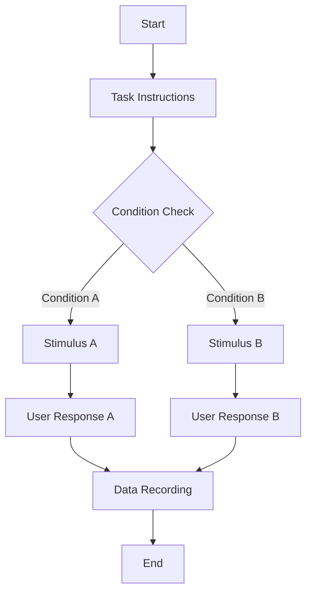

# Psychology Experiment Analyzer Skill

## Description
A specialized skill for analyzing psychology research papers to extract experimental designs, generate flowcharts, and document visual stimuli parameters.

## Usage
```bash
skill: "psychology-experiment-analyzer"
```

## Input Requirements
- Psychology research paper in markdown format
- Paper must contain detailed experimental methods sections
- Should include stimulus descriptions and experimental procedures

## Processing Steps

### Step 1: Experiment Identification
- Identify all experiments described in the paper
- Number and name each experiment
- Extract research objectives and hypotheses

### Step 2: Detailed Flowchart Generation
For each experiment, generate:

#### Mermaid Flowchart
- Use standard Mermaid syntax
- Strictly avoid parentheses in node labels
- Clear node type labeling:
  - 🎯 **Interaction Nodes**: User choice/reaction points
  - 🖼️ **Image Stimulus Nodes**: Visual stimulus presentation
  - 📝 **Text Stimulus Nodes**: Text information display
  - ⏱️ **Timing Nodes**: Time measurement points

#### Node Annotations (outside Mermaid)
**Text Stimulus Nodes:**
- Task instructions at experiment start
- Specific guidance text
- Feedback message descriptions

**Image Stimulus Nodes:**
- Detailed image composition description
- Visual element arrangement
- Color, shape, size visual features
- Examples: "Red circle at screen center, 5cm diameter, gray background"

**User Interaction Nodes:**
- Specific user actions (key press, mouse click, verbal response)
- Recorded data metrics:
  - Reaction time (milliseconds)
  - Accuracy rate (percentage)
  - Choice results (binary or multi-category)
  - Error types

#### Experiment Difference Explanation
- If experiments are similar, detail specific differences
- Variable control variations
- Stimulus material changes
- Measurement metric additions/modifications

### Step 3: Visual Stimulus Parameter Documentation

#### Image Enumeration
For each image used in experiments:
- Image number and description
- Usage context in experiment

#### Detailed Parameter Specifications
**Geometric Parameters:**
- Position coordinates (X, Y)
- Shape type (circle, square, triangle, etc.)
- Size parameters (diameter, side length, radius, etc.)
- Rotation angle (degrees)

**Visual Parameters:**
- Color values (RGB/HEX)
- Transparency
- Border style and color
- Fill style

#### Pixel Conversion Specification
**Conversion Standards:**
- Fixed DPI: 96 DPI (standard screen resolution)
- Precise visual angle to pixel conversion formula
- Consider viewing distance (standard 57cm)

**Conversion Examples:**
- 1 degree visual angle ≈ 96 pixels (at 57cm viewing distance)
- Detailed recording of original visual angle and converted pixel values

## Output Format

```markdown
# Psychology Experiment Analysis Report

## Step 1: Experiment Identification
- Experiment 1: Color Judgment Task
- Experiment 2: Shape Discrimination Task

## Step 2: Detailed Flowcharts

### Experiment 1 Flowchart


**Node Annotations:**
- Node B (Text Stimulus): "Please carefully observe the shapes on screen and judge their colors"
- Node D (Image Stimulus): "Red circle at screen center, diameter corresponds to 2 degrees visual angle"
- Node F (User Interaction): "Press F key for red, J key for blue, record reaction time and accuracy"

### Experiment 2 Flowchart
[Similar structure...]

**Experiment Difference Explanation:**
Experiment 2 reduced stimulus presentation time from 500ms to 250ms, increasing difficulty...

## Step 3: Visual Stimulus Parameters

### Image 1: Red Circle
- Usage Context: Color judgment task in Experiment 1
- Position: Screen center (X: 960, Y: 540)
- Shape: Circle
- Diameter: 2 degrees visual angle → 192 pixels
- Color: RGB(255, 0, 0)
- Rotation Angle: 0 degrees

### Image 2: Blue Square
[Detailed parameters...]
```

## Technical Specifications
- Mermaid syntax strictly compliant, avoiding compilation errors
- All size parameters dual-labeled (visual angle + pixels)
- Data metrics explicitly quantified
- Stimulus descriptions specific and reproducible

## Examples

When the skill is invoked, it will prompt for:
1. Psychology paper markdown content
2. Any specific experimental focus areas
3. Custom conversion parameters if needed

The skill will then process the paper and generate the comprehensive three-step analysis report.