#### **BRIEF REPORT**

## **Perceptual comparisons modulate memory biases induced by new visual inputs**

**Joseph M. Saito1 · Matthew Kolisnyk2 · Keisuke Fukuda1,[3](http://orcid.org/0000-0003-2450-4345)**

Accepted: 22 May 2022 © The Psychonomic Society, Inc. 2022 / Published online: 6 September 2022

#### **Abstract**

It is well-established that stimulus-specifc information in visual working memory (VWM) can be systematically biased by new perceptual inputs. These memory biases are commonly attributed to interference that arises when perceptual inputs are physically similar to VWM contents. However, recent work has suggested that explicitly comparing the similarity between VWM contents and new perceptual inputs modulates the size of memory biases above and beyond stimulus-driven efects. Here, we sought to directly investigate this modulation hypothesis by comparing the size of memory biases following explicit comparisons to those induced when new perceptual inputs are ignored (Experiment [1\)](#page-1-0) or maintained in VWM alongside target information (Experiment [2\)](#page-6-0). We found that VWM reports showed larger attraction biases following explicit perceptual comparisons than when new perceptual inputs were ignored or maintained in VWM. An analysis of participants' perceptual comparisons revealed that memory biases were amplifed after perceptual inputs were endorsed as similar—but not dissimilar—to one's VWM representation. These patterns were found to persist even after accounting for variability in the physical similarity between the target and perceptual stimuli across trials, as well as the baseline memory precision between the distinct task demands. Together, these fndings illustrate a causal role of perceptual comparisons in modulating naturally-occurring memory biases.

**Keywords** Visual working memory · Memory distortion · Perceptual interference

Visual working memory (VWM) and perception interact to infuence behavior. For example, VWM content can be used proactively to facilitate visual stability in our dynamic visual environment (Bae & Luck, [2019](#page-11-0), [2020](#page-11-1); Fischer et al., [2020](#page-11-2); Fischer & Whitney, [2014;](#page-11-3) Kiyonaga et al., [2017](#page-11-4); Liberman et al., [2014](#page-11-5)). However, the reciprocal infuence of perception on VWM may not be as benefcial. Visual stimuli that are perceived during the maintenance of a VWM representation have been shown to systematically distort the representation, even when the perceived stimuli are irrelevant to ongoing behavior (see Lorenc et al., [2021,](#page-11-6) for review). Studies elucidating this *perceptual interference efect* highlight the role of physical similarity between mnemonic and perceptual representations in producing memory distortion (Sun et al., [2017](#page-11-7); Teng & Kravitz, [2019\)](#page-11-8). At the neural level, interference caused by physical similarity may arise from corresponding overlap in the sensory cortex to support VWM maintenance and perception simultaneously (Rademaker et al., [2019;](#page-11-9) Teng & Kravitz, [2019](#page-11-8)). Thus, VWM biases may occur as natural, stimulus-driven consequences of a dual-functioning sensory system.

However, these stimulus-driven biases may be further modulated by explicitly comparing VWM representations to perceptual inputs. In a series of recent experiments, Fukuda et al. ([2022](#page-11-10)) found that VWM biases induced by new perceptual inputs were larger when individuals explicitly endorsed the percept as being similar rather than dissimilar to their VWM representation. Critically, the authors were able to show that these *similarity-induced memory biases* (SIMB) were selectively dependent on the perceived similarity of the novel percept, such that larger memory biases following endorsements of similarity than

- 1 Department of Psychology, University of Toronto, 100 St. George Street, Toronto, ON M5S 3G3, Canada
- 2 Department of Psychology, Western University, 1151 Richmond Street, London, ON N6A 3K7, Canada
- 3 Department of Psychology, University of Toronto Mississauga, 3359 Mississauga Road, Mississauga, ON L5L 1C6, Canada

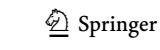

\* Keisuke Fukuda keisuke.fukuda@utoronto.ca

dissimilarity remained even after the physical similarity between the VWM and percept was matched across trials. This evidence was used to suggest that explicitly comparing VWM representations to perceptual inputs causally modulates perceptual interference efects.

Yet, the nature of this ostensible modulation remains unclear. Based on their fndings, Fukuda et al. [\(2022\)](#page-11-10) posited that endorsing similarity between a VWM and incoming percept amplifes stimulus-driven biases. However, the authors did not directly compare biases following perceptual comparisons to those induced by perceptual interference alone. Therefore, SIMB may occur even in the absence of explicit perceptual comparisons whenever a subjectively similar percept is perceived. If so, explicit perceptual comparisons may not modulate memory biases but instead separate trials where bias occurs (i.e., percepts resulting in "similar" endorsements) from trials where bias does not occur (i.e., percepts resulting in "dissimilar" endorsements). Moreover, if diferences in memory bias between similar and dissimilar endorsements indeed refect causal modulation by explicit perceptual comparisons, this could be equally accomplished by two distinct mechanisms. As posited by Fukuda et al. ([2022](#page-11-10)), explicitly endorsing similarity might amplify stimulus-driven biases. Alternatively, explicitly rejecting similarity, or endorsing dissimilarity, might dampen stimulus-driven biases (cf. Schacter et al., [2011\)](#page-11-11). This ambiguity bears considerable weight in determining whether explicit perceptual comparisons can help preserve VWM fdelity or risk exacerbating VWM distortions.

In the present study, we addressed this issue by manipulating the demand for explicit perceptual comparisons across multiple tasks. We frst compared the size of memory biases following perceptual comparisons to those observed in a typical perceptual interference paradigm, where participants are told to ignore the perceptual probe (Experiment [1](#page-1-0)). However, since explicit perceptual comparisons render the perceptual probe task-relevant, any observed bias modulation in Experiment [1](#page-1-0) may be attributed to the task-relevance of the perceptual probe. Therefore, we also conducted a follow-up experiment where we examined the modulatory efect of perceptual comparisons while preserving the task-relevance of the perceptual probe across tasks. Specifcally, we compared memory biases following perceptual comparisons to those reported instead when participants remembered the perceptual probe for a subsequent memory report (Experiment [2](#page-6-0), Rademaker et al., [2015](#page-11-12)). In both experiments, we used an identical delayed estimation task but varied the instructions for processing the perceptual probe to isolate the efect of task demands themselves. We also assessed the ubiquity of any observed phenomenon by conducting each experiment twice using familiar (i.e., color) and novel (i.e., shape, Li et al., [2020\)](#page-11-13) stimulus spaces.

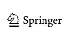

## **Experiment 1**

In Experiment [1,](#page-1-0) we assessed the causal role of explicit perceptual comparisons by comparing memory biases following comparisons to those reported after perceptual inputs were ignored. If explicit perceptual comparisons modulate VWM biases, we should expect that memory biases following comparisons will differ from those induced by merely perceiving the novel probe. Moreover, if perceptual comparisons result in the reliable amplifcation of memory biases, as posited by Fukuda et al. ([2022](#page-11-10)), we should fnd that memory biases following similar but not dissimilar—endorsements will be larger than those induced when the probe is perceived but ignored.

#### **Method**

## **Participants**

All participants in the experiment were undergraduate students at the University of Toronto Mississauga that reported normal or corrected-to-normal visual acuity and normal color vision. Each participant provided informed consent in accordance with the procedures approved by the Research Ethics Board at the University of Toronto.

We conducted a series of planned *t* tests and a withinsubjects analysis of variance (ANOVA) with two factors (i.e., task demand and physical distance between the memory and probe items) to compare the magnitude of VWM biases across tasks. Given that extant demonstrations of SIMB report relatively large effect sizes (Fukuda et al., [2022](#page-11-10)), we anticipated similar effect sizes again here (Cohen's *d* > 0.8; ηp 2 > 0.16). An a priori power calculation performed with an alpha level of 0.05, statistical power of 0.9, and an average population correlation between the repeated measures (*ρ* = 0.50) indicated that we would need at least 16 subjects to obtain such an effect (Faul et al., [2007](#page-11-14)). We doubled this sample size estimate to 32 subjects to ensure that at least 16 data points were collected in each counterbalancing order (see Procedure section).

We recruited 41 participants in Experiment 1A (color) and 40 participants for Experiment 1B (shape). To extract a reliable measure of memory precision and memory bias, we assessed the proportion of memory reports made with high confdence in the baseline and experimental conditions for each participant. This led to the exclusion of fve participants that failed to meet our a priori threshold of at least 15% confdent trials in both task conditions (1A: two, 1B: three) and one participant that did not report any memories confdently in one of the baseline conditions (1B: one). The remaining

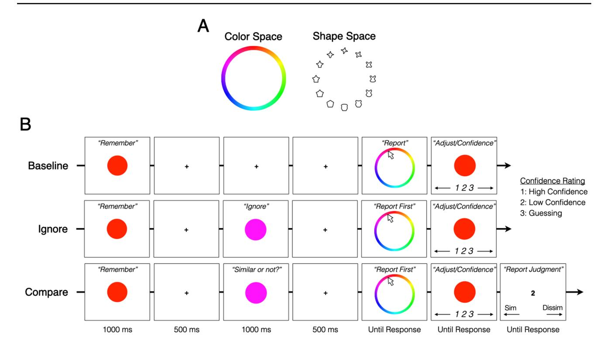

**Fig. 1** Experiment [1](#page-1-0) schematic. *Note.* **a** Color and shape spaces. For illustration purposes, the shape space is shown with 12 exemplars. **b** The trial procedure for each of the conditions across the two memory tasks

participants in the sample reported their memory with high confdence on more than 70% of baseline and experimental trials in both tasks. Of note, when we reconducted our analyses while including the individuals that reported a low number of confdent trials, all the efects persisted (see Supplementary Material 1). Six other participants were excluded for not following instructions (1A: one), experimenter error (1A: one), technical malfunction (1A: two), not fnishing the experiment (1A: one), and failing to report any similar endorsements (1B: one). Data collected from the remaining 34 (24 female, mean age = 19.7 years) and 35 participants (26 female, mean age = 19.5 years) in Experiments 1A and 1B, respectively, were submitted to analysis.

#### **Apparatus and Stimuli**

Participants completed the experiment remotely using a personal desktop or laptop computer. To ensure that experimental conditions were satisfactory, completion of all task procedures was monitored by researchers in real-time using Zoom video conference software (Zoom Video Communications Inc., 2016). All stimuli were generated and presented in PsychoPy3 (Peirce, [2007\)](#page-11-15), which was installed and run locally on each participant's computer.

For the color space, we sampled 360 equally spaced color values from CIE L\*a\*b\* space centered at a\* = 20 and b\* = 38 with a radius of 60. L\* was set to 70. The memory and probe items for a given trial were sampled from this color set and presented as circular color patches at 200 pixels in diameter. A circular color wheel was also created using this set of color values—such that each color value occupied 1° of the color wheel—and was presented (randomly rotated) at 800 pixels in diameter (Fig. [1a](#page-2-0)).

For the shape space, we used a continuous shape space whose circular visual similarity has been empirically validated (Li et al., [2020](#page-11-13)). The memory and probe items for a given trial were sampled from 360 shapes within this stimulus set and presented at 200 × 200 pixels. The shape wheel for a given trial consisted of 18 equidistant exemplar shapes presented in a circular arrangement (randomly rotated) at 800 pixels in diameter (Fig. [1a](#page-2-0)).

Given the online format of our data collection procedure, colors generated in CIE L\*a\*b\* space were likely rendered with additional variability caused by individual diferences in monitor luminance. This presumed variability acts as an additional source of noise in the data that can decrease statistical power and limit the precise quantifcation of efect sizes. However, there exists both direct and indirect evidence that monitor luminance did not meaningfully contaminate our results. Firstly, others have directly compared working memory performance between calibrated and uncalibrated monitors and found consistent results (Bae et al., [2014;](#page-11-16) Bae

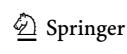

et al., [2015](#page-11-17)), suggesting that performance variability induced by diferences in monitor luminance is minimal. Second, with sufcient random sampling, variability caused by unequal monitor luminance is extremely unlikely to produce the systematic response errors that we fnd in the present experiments. Lastly, in the present study, we replicated all general fndings in color stimuli and shape stimuli, the latter of which does not have any established dependencies on monitor luminance.

#### **Procedure**

Each participant completed two working memory tasks in a blocked order. The order of task completion was counterbalanced across participants, such that half of the participants completed the Compare Task before completing the Ignore Task and the other half of participants completed the tasks in the reverse order. A separate analysis confrmed no main efects of counterbalancing order nor any signifcant interactions between counterbalancing order and task demands (see Supplementary Material 2). Thus, we collapsed across counterbalancing order in the analysis below.

For each task, participants performed fve blocks of 32 trials that were pseudorandomized between the baseline and experimental conditions. The compare trial condition only appeared in the Compare Task and the ignore trial condition only appeared in the Ignore Task (Fig. [1b](#page-2-0)). The baseline condition was identical in both tasks. For brevity, the description of each memory task focuses on the use of color stimuli. All procedural diferences between color and shape are explicitly noted.

**Compare Task** Each trial in the baseline condition began with a memory item presented at the center of the screen for 1,000 ms, which participants were instructed to remember as precisely as possible (Fig. [1b\)](#page-2-0). The memory item was randomly sampled from the circular color space. Presentation of the memory item was followed by a 2,000-ms maintenance interval. At the completion of the maintenance interval, a color wheel (see Stimuli section; Fig. [1a](#page-2-0)) was presented on a blank screen and participants were instructed to report the memory item. Using the mouse, participants reported the memory item by clicking on the color wheel. In the shape tasks, participants were told that the shape wheel consisted of 360 selectable items and that they could click in between the exemplar shapes when necessary (see Stimuli section; Fig. [1a](#page-2-0)). After selecting, a response probe was displayed at the center of the screen in the selected color. Participants were then able to use the left and right arrow keys to adjust the response probe around the circular color space, if necessary, to match what they remembered more precisely. Once satisfed, they indicated their confdence in the accuracy of their memory report by pressing one of three keyboard buttons (*high confdence, low confdence, guessing*). The accuracy of the memory report was emphasized and was therefore reported without an imposed time limit.

In each trial of the compare condition, participants completed a perceptual comparison during the maintenance interval (Fig. [1b](#page-2-0)). Five hundred ms after the ofset of the memory item, a novel probe item was presented at the center of the screen for 1,000 ms. The novel probe item was sampled ±30°, 60°, or 90° away from the memory item in the circular color space. Participants were instructed to compare the novel probe item to the memory item being retained and judge whether the novel probe item appeared similar or dissimilar to the memory item. Participants were told that they would need to remember their similarity judgment for a subsequent report but should not remember the probe item itself. After another 500-ms blank delay following the ofset of the novel probe item, participants reported the memory item following the same two-step report procedure described above. After participants indicated their confdence in the accuracy of their memory report, the number "2" was displayed at the center of a blank screen to indicate that they should report their similarity judgment made on the novel probe item by pressing the left or right arrow key (i.e., left for similar, right for dissimilar). The memory item was always reported before the similarity judgment.

The baseline condition occurred in 25% of trials and the compare condition occurred in the remaining 75%. Within the compare condition, the physical distance between the memory and probe items was counterbalanced across the three possible values indicated above (±30°, 60°, 90°). The direction of ofset from the memory item was randomly assigned trial-by-trial.

**Ignore Task** The same baseline condition described above occurred in 25% of trials in the Ignore Task. The remaining 75% of trials were performed in the ignore condition, which was identical to the compare condition in the Compare Task, with the exception that participants were instructed to ignore the novel probe item while still maintaining fxation.

#### **Analyses**

For every trial, we computed the report error by subtracting the degree value of the memory report in the circular feature space from that of the original stimulus. We aligned the direction of report errors across trials such that positive error values indicated memory reports that were in the direction of the novel probe (signed response errors). The direction of report errors in the baseline condition was randomly assigned. To quantify the size of the memory bias across trials, we computed the mean bias magnitude using the mean signed response error for each condition. A positive bias magnitude indicated a memory

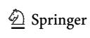

bias towards the novel probe item. Memory precision was calculated by computing the inverse standard deviation (i.e., 1/*SD*) of the raw response errors within the baseline condition for each task. For completeness, we report memory precision across all trials and within high-confdence trials only.

To assess the modulatory role of explicit perceptual comparisons, we matched the physical distance between the memory and probe items across trials in our analyses to equate all memory biases that were induced by the physical similarity between items. To do this, for each participant, we identifed the physical probe distances that contained both similar and dissimilar endorsements across different trials (ambivalent physical distances). For example, if a given participant made similar and dissimilar endorsements for 30°- and 60°-ofset probes, but only made dissimilar endorsements for 90°-ofset probes, 30° and 60° would be considered ambivalent for that participant, but 90° would not. We then calculated the mean bias magnitude following similar and dissimilar endorsements separately for each ambivalent distance. In the above example, we would separately calculate the mean bias magnitude for similar endorsements at 30°, dissimilar endorsements at 30°, similar endorsements at 60°, and dissimilar endorsements at 60°. This produced a single point estimate of memory bias for similar and dissimilar endorsements at each ambivalent distance. We then averaged the mean bias magnitudes for similar and dissimilar endorsements separately across all ambivalent physical distances. That is, we averaged together the point estimates of similar bias magnitude across ambivalent distances and repeated this process for dissimilar endorsements. Together, this process equated all biases induced by physical similarity and isolated the diferences in bias magnitude that could be reasonably attributed to the perceptual comparison itself. We then used the ambivalent physical distances identifed for a given participant in the Compare Task to repeat this averaging procedure for the same participant in the Ignore Task.

To include as many memory reports as possible for each participant, we did not place an arbitrary threshold on the number of similar and dissimilar endorsements that were required for a given physical distance to be considered ambivalent. We confrmed in separate analyses that none of the results of our ambivalent distance analysis could be attributed to low or unbalanced numbers of endorsements per ambivalent distance (see Supplementary Material 3).

We report Bayes Factors (*BF*) in addition to relevant *t* and *F* statistics to provide complementary statistical evidence for our observed efects. *BF01* indicates evidence in favor of the null hypothesis and *BF10* indicates evidence in favor of the alternative hypothesis.

To report our fndings with minimal assumptions, all statistical analyses were performed with outliers (i.e., memory bias >3*SD* above/below mean) included. None of the reported results are changed by removing these outliers.

## **Results and Discussion**

#### **Perceptual comparisons amplify stimulus‑driven memory biases**

A series of one-sample *t* tests revealed signifcant memory biases in the Compare Task (Table [1](#page-5-0); Fig. [2a\)](#page-6-1), replicating previous work showing that perceptual comparisons between VWM content and perceptual inputs induce reliable memory biases (Fukuda et al., [2022](#page-11-10)). We also observed signifcant memory biases in the Ignore Task (Table [1](#page-5-0); Fig. [2a\)](#page-6-1), demonstrating that novel perceptual inputs can induce VWM biases, even in the presumed absence of explicit perceptual comparisons (see Lorenc et al., [2021](#page-11-6), for review).

To test for bias modulation, we conducted a 2 (task demand: compare, ignore) × 3 (physical distance: 30°, 60°, 90°) repeated-measures ANOVA comparing memory biases between tasks at each physical distance. Consistent with our hypothesis, we found a main efect of task demand—color: *F*(1, 33) = 17.76, *p* < .001, ηp 2 = 0.35, *BF10* = 1.48 × 104 ; shape: *F*(1, 34) = 19.24, *p* < .001, ηp 2 = 0.36, *BF10* = 6.46 × 103 —driven by larger memory biases in the Compare Task than the Ignore Task (Fig. [2a\),](#page-6-1) color: Δ*M =* 2.37°*,* 95% CI [1.23, 3.52°], *t*(33) = 4.21, *pholm* < .001, Cohen's *d* = 0.72, *BF10 =* 1.39 × 104 ; shape: Δ*M =* 2.06°*,* 95% CI [1.10, 3.01°]), *t*(34) = 4.39, *pholm* < 0.001, Cohen's *d* = 0.74, *BF10 =* 3.19 × 103 . The performed ANOVAs also revealed a signifcant main efect of physical distance—color: *F*(2, 66) = 11.35, *p* < .001, ηp 2 = 0.26, *BF10* = 1.70 × 102 ; shape: *F*(1.61, 54.73) = 6.62, *p* = .005, ηp 2 = 0.16, *BF10* = 5.40 driven by larger memory biases at further physical distances in the color stimuli and smaller memory biases at further physical distances in the shape stimuli (Fig. [2a](#page-6-1)). The interaction between task demands and physical distances was not signifcant—color: *F*(2, 66) = 0.19, *p* = .829, ηp 2 < 0.01, *BF01* = 9.88; shape: *F*(2, 68) = 0.14, *p* = .869, ηp 2 < 0.01, *BF01* = 1.18 × 10.

## **Bias amplifcation is not explained by task diferences in memory precision**

To ensure that diferences in memory bias between tasks could not be explained by systematic diferences in memory quality, we compared memory precision between the baseline conditions in each task where no probe was presented. We found no diferences in memory precision when measuring across all trials—color: *t*(33) = 1.30, *p* = .203, Cohen's *d* = 0.22, *BF01 =* 2.52; shape: *t*(34) = 0.31, *p* = .761, Cohen's *d* = 0.05, *BF01 =* 5.29—and when measuring

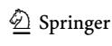

Table 1 Memory biases across physical distances in Experiment 1

| Color (Exp. 1A)                                | 7            |      |                          |            |                |                |                            |                      | Shape        | Shape (Exp. 1B) |          |            |                |                |                            |               |
|------------------------------------------------|--------------|------|--------------------------|------------|----------------|----------------|----------------------------|----------------------|--------------|-----------------|----------|------------|----------------|----------------|----------------------------|---------------|
|                                                |              | t    | d                        | $\Delta M$ | Lower Bound | Upper Bound | Cohen's d BF 10 | $BF_{I0}$            |              | t               | d        | $\Delta M$ | Lower Bound | Upper Bound | Cohen's d BF 10 | $BF_{I0}$     |
| Compare task 30° 5.41 <b>&lt;.001</b> *** 3.32 | 30°          | 5.41 | <.001***                 | 3.32       | 2.07           | 4.57           | 0.93                       | $3.54 \times 10^{3}$ | 30°          | 8.12            | <.001*** | 4.00       | 3.00           | 5.00           | 1.37                       | 6.47 >        |
|                                                | $_{\circ}09$ | 8.58 | <b>&lt;.001</b> *** 5.21 | 5.21       | 3.97           | 6.44           | 1.47                       | $1.71 \times 10^7$   | °09          | 5.72            | <.001*** |            | 2.80           | 5.89           | 0.97                       | $9.13 \times$ |
|                                                | $^{\circ}06$ | 7.75 | <b>&lt;.001</b> *** 5.29 | 5.29       | 3.90           | 89.9           | 1.33                       | $2.00 \times 10^6$   | °06          | 5.29            | <.001*** |            | 1.66           | 3.73           | 0.89                       | 2.74 ×        |
| Ignore task                                    | $30^{\circ}$ | 1.05 | 0.302                    | 0.61       | -0.57          | 1.78           | 0.18                       | 0.31                 | $30^{\circ}$ | 2.83            | **800.0  |            | 0.46           | 2.83           | 0.48                       | 5.26          |
|                                                | °09          | 4.98 | <b>&lt;.001</b> *** 2.98 | 2.98       | 1.76           | 4.20           | 0.85                       | $1.11 \times 10^3$   | °09          | 4.50            | <.001*** | 2.51       | 1.38           | 3.65           | 92.0                       | 3.27 ×        |
|                                                | $^{\circ}06$ | 4.95 | <b>&lt;.001</b> *** 3.12 | 3.12       | 1.84           | 4.41           | 0.85                       | $1.03 \times 10^3$   | °06          | 1.44            | 0.160    | 0.71       | -0.29          | 1.70           | 0.24                       | 0.46          |

<106 <103 <103 <103 <103 <103 <103 <103 <103 <103 <103 <103 <103 <103 <103 <103 <103 <103 <103 <103 <103 <103 <103  <103        

across confident trials only—color: t(33) = 0.59, p = .560, Cohen's d = 0.10,  $BF_{01} = 4.63$ ; shape: t(34) = -0.95, p = .350, Cohen's d = -0.16,  $BF_{01} = 3.64$ . Thus, differences in memory precision between tasks were not sufficient in explaining bias modulation.

# Bias amplification is driven by perceived similarity, not physical similarity

To determine whether bias modulation stemmed from perceived similarity or dissimilarity, we computed the size of memory biases following both types of endorsements separately before comparing them to biases in the Ignore Task. We disentangled any concomitance between physical similarity and perceived similarity in this analysis by focusing on ambivalent physical distances that contained similar and dissimilar endorsements on different trials and matching the proportion of each endorsement before averaging (see Method).

First, we compared the size of memory biases following perceived similarity to those observed following perceived dissimilarity. Consistent with the framework posited by Fukuda et al. (2022), our paired-sample t tests revealed that memory biases were indeed larger following perceived similarity than perceived dissimilarity (Fig. 2b), color:  $\Delta M = 6.88^{\circ}$ , 95% CI  $[4.36, 9.40^{\circ}], t(33) = 5.56, p < .001, Cohen's d = 0.95, BF_{10}$ =  $5.41 \times 10^3$ ; shape:  $\Delta M = 4.73^\circ$ , 95% CI [0.00, 9.46°], t(34) $= 2.03, p = 0.050, Cohen's d = 0.34, BF_{10} = 1.12.$  From here, we compared the biases following perceived similarity and dissimilarity to the biases observed in the Ignore Task to determine if larger biases following perceived similarity than dissimilarity were indicative of bias amplification. Paired sample t-tests revealed that memory biases were larger in the Compare Task following endorsements of similarity (Fig. 2b), color:  $\Delta M = 6.32^{\circ}$ , 95% CI [4.62, 8.02°], t(33) = 7.57, p <.001, Cohen's d = 1.30,  $BF_{10} = 1.24 \times 10^6$ ; shape:  $\Delta M = 1.30$ 5.19°, 95% CI [2.71, 7.67°], t(34) = 4.25, p < .001, Cohen's d= 0.72,  $BF_{10}$  = 1.65 × 102, but not following endorsements of dissimilarity (Fig. 2b), color:  $\Delta M = -0.56^{\circ}$ , 95% CI [-2.78,  $1.67^{\circ}$ ], t(33) = -0.51, p = .615, Cohen's d = -0.09,  $BF_{01}$ = 4.83; shape:  $\Delta M = 0.46^{\circ}$ , 95% CI [-3.78, 4.70°], t(34) =0.22, p = .827, Cohen's d = 0.04,  $BF_{01} = 5.38$ . We found this conclusion to be true even when we constrained the analysis to include only trials where memory reports were made with

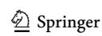

 $^1$  We noted that evidence favoring a difference between perceived similarity and dissimilarity was smaller in shape stimuli than color stimuli. We reasoned that this likely occurred because of the additional outlier values in shape, including two sizable outliers in the dissimilar response bin (= 55.88°, -42.13°) that made for a noisy comparison between conditions. As noted in our Analyses section, removing these outliers and reconducting this analysis drastically increased the effect size of this difference,  $\Delta M = 4.61^\circ, 95\%$  CI [2.24, 6.97°],  $t(30) = 3.97, \, p < .001$ , Cohen's  $d = 0.71, \, BF_{10} = 7.17 \times 10$ .

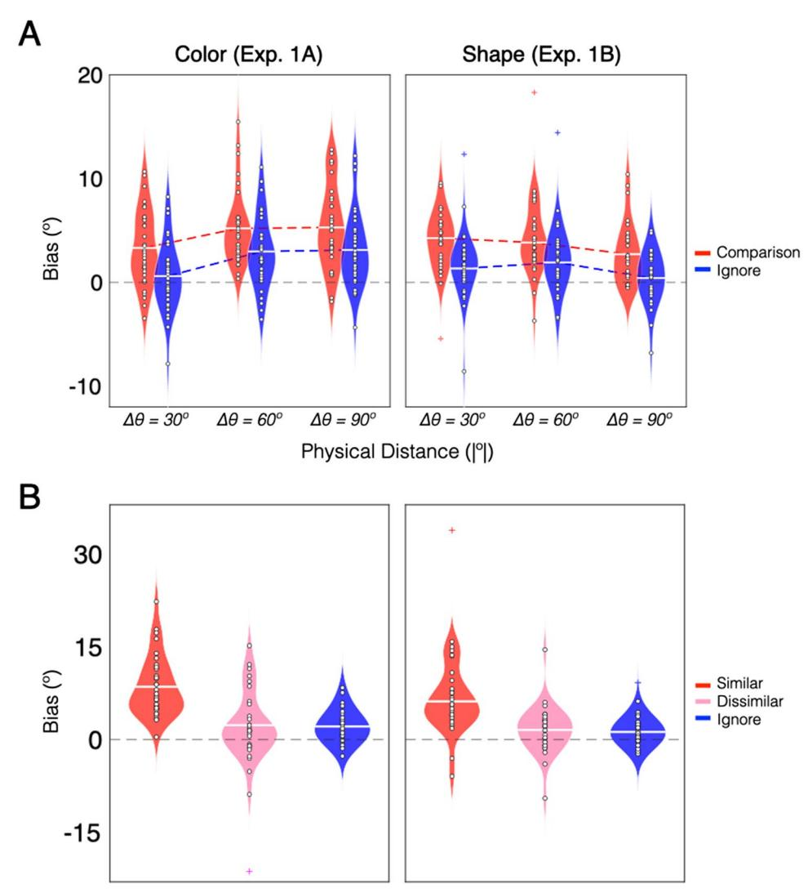

**Fig. 2** Experiment [1](#page-1-0) results. *Note.* **a** Violin plots of the bias magnitude in each task across physical distances. Positive values indicate memory biases toward the novel probe item. The horizontal white line in each plot indicates the mean bias magnitude across participants. White circles in each plot indicate the mean bias magnitude for

high confdence (see Supplementary Material 4). We also confrmed that bias amplifcation following similar endorsements refected a bona fde shift in participants' responses towards the probe, and not an increase in swap errors (see Supplementary Materials 5–6). Together, the results of Experiment [1](#page-1-0) provide robust evidence that task demands requiring explicit comparisons between VWM representations and perceptual inputs risk magnifying naturally-occurring distortions caused by perceptual interference.

## **Experiment 2**

To address the possibility that bias modulation in Experiment [1](#page-1-0) was determined by the task-relevance of the probe, we manipulated task demands in Experiment [2](#page-6-0) to equate the

a given participant. Colored '+' symbols indicate outliers. **b** Violin plots of the bias magnitude separated by similarity endorsements and matched for physical distance within subjects. Two outliers in the dissimilar shape bin did not ft in the fgure (= 55.88°, −42.13°). (Color fgure online)

relevance of the perceptual probe between tasks (i.e., *compare to memory* or *remember*). If bias amplifcation in Experiment [1](#page-1-0) was determined by perceptual comparisons and not by probe relevance, we should expect larger memory biases following perceptual comparisons again in Experiment [2.](#page-6-0)

## **Method**

#### **Participants**

All participants in the experiment were undergraduate students at the University of Toronto Mississauga that reported normal or corrected-to-normal visual acuity and normal color vision. Each participant provided informed consent in accordance with the procedures approved by the Research Ethics Board at the University of Toronto.

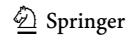

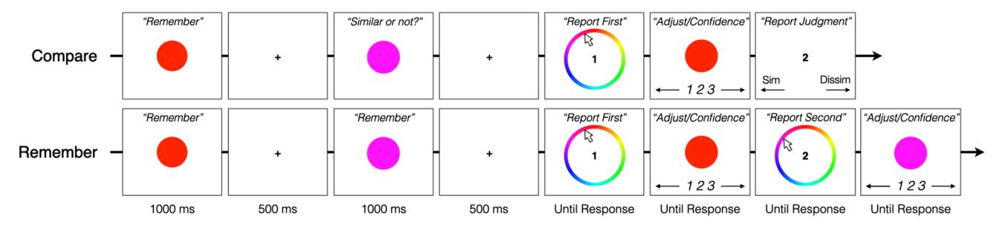

**Fig. 3** Experiment [2](#page-6-0) schematic. *Note.* The trial procedure for each of the experimental conditions in the two memory tasks in Experiment [2](#page-6-0)

We recruited 49 participants for Experiment 2A (color) and 50 participants for Experiment 2B (shape). To extract a reliable measure of memory precision and memory bias, we again assessed the proportion of memory reports made with high confdence in the baseline and experimental conditions for each participant. In the Remember Task, confdent trials were operationalized as those in which participants reported both the memory and probe items with high confdence and did not prioritize the memory item at the expense of the relevant probe. This assessment led to the exclusion of nine participants who failed to meet the a priori threshold of at least 15% confdent trials in both conditions (2A: four, 2B: fve) and three participants who did not report any memories confdently in one of the baseline conditions (2B: three). The remaining participants in the sample reported their memory with high confdence on more than 80% and 50% of baseline and experimental trials in the Remember Task and more than 80% and 75% of baseline and experimental trials of the Compare Task, respectively. Six other participants were excluded for not following instructions (2B: one), poor overall task performance (memory precision in baseline condition >3*SD* below the sample mean; 2A: one), not fnishing the experiment (2A: one, 2B: two), and failing to report any similar endorsements (2B: one). See Supplementary Material 7 for analyses that include unconfdent and poor performing exclusions. Data collected from the remaining 43 (36 female, mean age = 19.1 years) and 38 participants (31 female, mean age = 18.5 years) in Experiments 2A and 2B, respectively, were subjected to analysis.

#### **Apparatus and Stimuli**

Participants were seated approximately 60cm away from an LCD monitor (refresh rate = 60 Hz) in the laboratory space. All the stimuli were generated and presented in MATLAB using the Psychophysics Toolbox (Brainard, [1997](#page-11-18)). The stimulus spaces were identical to Experiment [1.](#page-1-0)

#### **Procedure**

Each participant completed two working memory tasks following the same blocked structure used in Experiment [1](#page-1-0). A

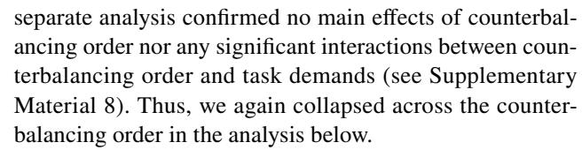

To minimize accidental reporting of the wrong item in the Remember Task, the numbers "1" and "2" were displayed at the center of the screen for the memory reports and similarity reports in both tasks (Fig. [3\)](#page-7-0).

### **Compare Task** Identical to Experiment [1.](#page-1-0)

**Remember Task** The same baseline condition described in Experiment [1](#page-1-0) occurred in 25% of trials in the Remember Task (Fig. [1b](#page-2-0)). The remaining 75% of trials were performed in the remember condition, in which participants were instructed to remember the novel probe item as precisely as possible in anticipation of a subsequent memory report (Fig. [3\)](#page-7-0). Thus, participants attempted to remember both the memory item and the novel probe item on every trial. Participants then sequentially reported the memory item and novel probe item following the same two-step report procedure used in Experiment [1.](#page-1-0) The memory item was always reported before the novel probe item.

#### **Analyses**

Identical to Experiment [1](#page-1-0).

## **Results and Discussion**

## **Rendering novel inputs task‑relevant does not explain bias amplifcation**

One-sample *t* tests revealed signifcant memory biases in both the Compare Task and the Remember Task (Table [2](#page-8-0); Fig. [4a](#page-9-0)).

As in Experiment [1,](#page-1-0) a 2 (task demand: compare, remember) × 3 (physical distance: 30°, 60°, 90°) repeated-measures ANOVA uncovered a main efect of task demand—color: *F*(1, 42) = 19.65, *p* < .001, ηp 2 = 0.32, *BF10* = 7.88 ×

10; shape: F(1, 37) = 6.20, p = .017,  $\eta_p^2 = 0.14$ ,  $BF_{10} =$ 2.56—driven by significantly larger memory biases in the Compare Task than the Remember Task for both stimulus types (Fig. 4a), color:  $\Delta M = 1.34^{\circ}$ , 95% CI [0.73, 1.95°], t(42) = 4.43,  $p_{holm} < .001$ , Cohen's d = 0.68,  $BF_{10} = 1.57 \times 10^{-2}$  $10^3$ ; shape:  $\Delta M = 1.20^\circ$ , 95% CI [0.22, 2.17°], t(37) = 2.49,  $p_{holm} = .017$ , Cohen's d = 0.40,  $BF_{10} = 1.52$ . We confirmed again that these task differences in bias magnitude could not be explained by systematic differences in memory precision between tasks (see Supplementary Material 9). We also observed a main effect of physical distance in color stimuli,  $F(2, 84) = 17.52, p < .001, \eta_p^2 = 0.29, BF_{10} = 7.63$  $\times 10^6$ ; shape: F(2, 74) = 1.83, p = .168,  $\eta_p^2 = 0.05$ ,  $BF_{01}$ = 4.74, and a significant interaction between task demands and physical distances in shape stimuli (Fig. 4a), F(1.69, 62.36) = 7.94, p = .002,  $\eta_p^2 = 0.18$ ,  $BF_{10} = 4.48 \times 10$ ; color:  $F(2, 84) = 0.94, p = .396, \eta_p^2 = 0.02, BF_{01} = 7.79$ , that was driven by negligible task differences in bias magnitude at the furthest physical distance (Fig. 4a),  $\Delta M = 1.44^{\circ}$ , 95% CI [-1.04,  $3.92^{\circ}$ ], t(37) = 1.74,  $p_{holm} = .676$ .

From here, we again compared memory biases following similar and dissimilar endorsements to those observed in the Remember Task while controlling for the physical similarity between the memory and probe items across trials (see Method in Exp. 1). Paired-sample t tests showed that memory biases in the Compare Task were larger following similar endorsements than dissimilar endorsements (Fig 4b), color:  $\Delta M = 4.71^{\circ}$ , 95% CI [1.99, 7.43°], t(42)= 3.50, p = .001, Cohen's d = 0.53,  $BF_{10} = 2.68 \times 10$ ; shape:  $\Delta M = 4.58^{\circ}$ , 95% CI [2.14, 7.01°], t(37) = 3.81, p <.001, Cohen's d = 0.62,  $BF_{10} = 5.65 \times 10$ . When we compared biases following each type of endorsement to those observed in the Remember Task, we found that memory biases following similar endorsements were larger (Fig 4b), color:  $\Delta M = 4.89^{\circ}$ , 95% CI [3.27, 6.50°], t(42) = 6.12, p< .001, Cohen's d = 0.93,  $BF_{10} = 5.79 \times 10^4$ ; shape:  $\Delta M$ =  $4.54^{\circ}$ , 95% CI [2.30,  $6.79^{\circ}$ ], t(37) = 4.10, p < .001, Cohen's d = 0.67,  $BF_{10} = 1.23 \times 10^2$ , while memory biases following dissimilar endorsements were comparable (Fig **4b**), color:  $\Delta M = 0.17^{\circ}$ , 95% CI [-1.97, 2.32°], t(42) =0.16, p = .871, Cohen's d = 0.03,  $BF_{01} = 5.99$ ; shape:  $\Delta M = -0.03^{\circ}, 95\% \text{ CI } [-1.46, 1.39^{\circ}], t(37) = -0.05, p$ = .964, Cohen's d = -0.01,  $BF_{01} = 5.71$ . As in Experiment 1, each of the above comparisons persisted when we only included trials where memory reports were made with high confidence and when we accounted for low or unbalanced numbers of endorsements in each physical distance condition (see Supplementary Materials 10-11). We also confirmed again that bias amplification following similar endorsements reflected a bona fide shift in participants' responses towards the probe, and not an increase in swap errors (see Supplementary Material 12-13). These findings corroborate and extend conclusions from Experiment 1 by

 Table 2
 Memory biases across physical distances in Experiment 2

| Color (Exp. 2A) |              |       |          |            |                   |                |                        |                     | Shape        | Shape (Exp. 2B) |          |            |                |                |                            |                      |
|-----------------|--------------|-------|----------|------------|-------------------|----------------|------------------------|---------------------|--------------|-----------------|----------|------------|----------------|----------------|----------------------------|----------------------|
|                 |              | t     | d        | $\Delta M$ | ΔM Lower Bound | Upper Bound | Cohen's $d$ BF $_{I0}$ | $BF_{I0}$           |              | t               | d        | $\Delta M$ | Lower Bound | Upper Bound | Cohen's d BF 10 | $BF_{I0}$            |
| Compare task    | 30°          | 5.69  | <.001*** | 2.65 1.71  | 1.71              | 3.59           | 0.87                   | $1.52 \times 10^4$  | $30^{\circ}$ | 7.27            | <.001*** | 3.99       | 2.88           | 5.11           | 1.18                       | $1.06 \times 10^{6}$ |
|                 | °09          | 10.69 | <.001*** | 4.80       | 3.89              | 5.70           | 1.63                   | $5.15\times10^{10}$ | °09          | 6.36            | <.001*** | 4.29       | 2.93           | 5.66           | 1.03                       | $7.57 \times 10^4$   |
|                 | $^{\circ}06$ | 8.80  | <.001*** | 4.54 3.50  | 3.50              | 5.58           | 1.34                   | $2.18\times10^8$    | °06          | 2.36            | 0.024*   | 1.44       | 0.20           | 2.67           | 0.38                       | 2.02                 |
| Remember task   | $30^{\circ}$ | 1.74  | 0.089    | 0.77       | -0.12             | 1.67           | 0.27                   | 99.0                | $30^{\circ}$ | 1.86            | 0.071    | 1.08       | -0.10          | 2.25           | 0.30                       | 0.83                 |
|                 | °09          | 8.86  | <.001*** | 3.60 2.78  | 2.78              | 4.42           | 1.35                   | $2.64 \times 10^8$  | °09          | 3.93            | <.001**  | 2.18       | 1.06           | 3.31           | 0.64                       | $7.71 \times 10$     |
|                 | $^{\circ}06$ | 88.9  | <.001*** | 3.58       | 2.53              | 4.63           | 1.05                   | $6.25 \times 10^5$  | .06          | 4.10            | <.001*** | 2.88       | 1.46           | 4.30           | 0.67                       | $1.22\times10^2$     |
| 333             | 100          |       |          |            |                   |                |                        |                     |              |                 |          |            |                |                |                            |                      |

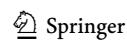

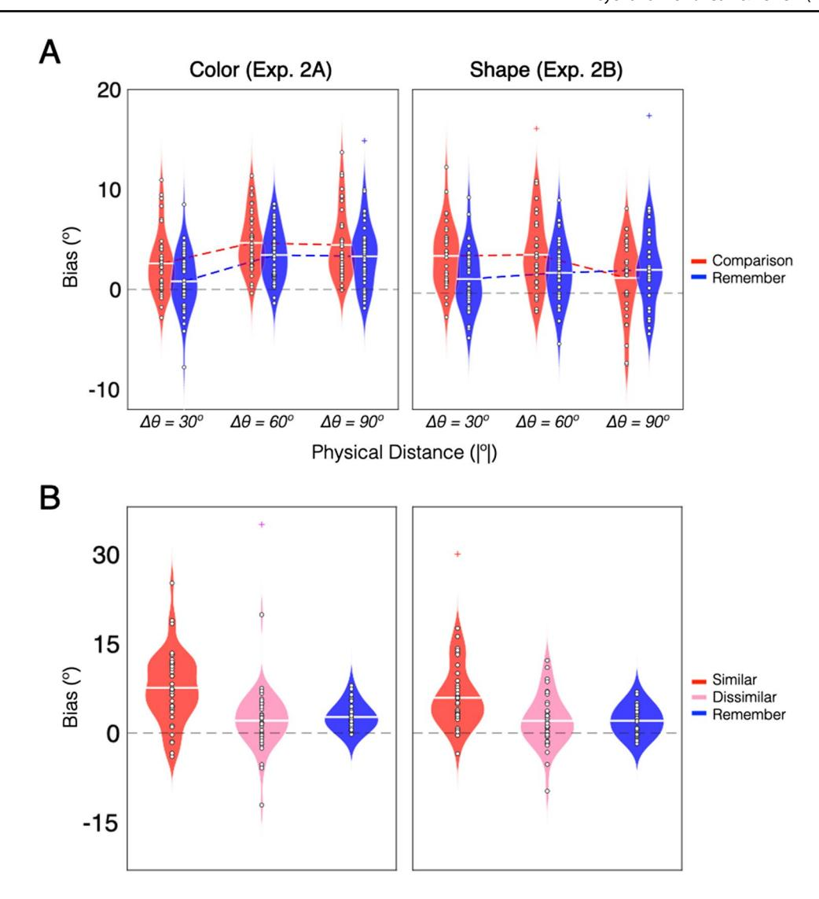

**Fig. 4** Experiment [2](#page-6-0) results. *Note.* **a** Violin plots of the bias magnitude in each task across physical distances. Positive values indicate memory biases toward the novel probe item. The horizontal white line in each plot indicates the mean bias magnitude across partici-

pants. White circles in each plot indicate the mean bias magnitude for a given participant. Colored '+' symbols indicate outliers. **b** Violin plots of the bias magnitude separated by similarity endorsements and matched for physical distance within subjects. (Color fgure online)

demonstrating that explicit perceptual comparisons amplify retroactive VWM biases that are induced by both relevant and irrelevant perceptual inputs.

## **General Discussion**

In the present study, we address a critical gap in previous work which suggested that explicit perceptual comparisons amplify VWM biases that are induced by new perceptual inputs (Fukuda et al., [2022](#page-11-10)). Specifcally, we wanted to determine whether perceptual comparisons indeed modulate memory biases and, if so, whether this modulation is accomplished via bias amplifcation following similar endorsements (Fukuda et al., [2022\)](#page-11-10) or bias dampening following dissimilar endorsements (cf. Schacter et al., [2011\)](#page-11-11). We directly compared VWM biases following perceptual comparisons to those induced when individuals perceived but ignored perceptual inputs. Our results showed that individuals reported larger memory biases following perceptual comparisons, but only when they endorsed the perceptual input as being like their memory item. Critically, this modulatory dependence on perceived similarity could not be equally explained by the physical similarity between items (see Lorenc et al., [2021,](#page-11-6) for review), the task-relevance of the perceptual probe, nor the precision of the VWM representation. These fndings are therefore consistent with the view that task demands themselves are responsible for modulating stimulus-driven biases in VWM representations.

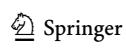

At frst pass, the attraction biases observed in the present study may be surprising. Previous research has shown that VWM representations can exhibit repulsion biases away from novel inputs and other VWM representations that are maintained simultaneously (Bae & Luck, [2017;](#page-11-19) Chen et al., [2019](#page-11-20); Golomb, [2015\)](#page-11-21). Some have posited that these opposing biases can be explained by processing mechanisms that fexibly exaggerate or mitigate featural overlap based on task goals (Chunharas et al., [2022](#page-11-22); Kiyonaga et al., [2017](#page-11-4); Scotti et al., [2021](#page-11-23)). While this account appears intuitive, it does not seem readily applicable to the fndings observed here. In the present experiments, the participants' goal was to preserve a fne-grained memory representation and minimize potential interference by the novel probe. By an adaptive processing account, we might have expected repulsion biases to occur, especially in the Remember Task, where simultaneous maintenance may have increased confusability between the two representations.

Then what factors might be able to unify the myriad of literature investigating VWM biases? One possibility is that encoding contexts infuence the directionality of the bias. A majority of studies that report repulsion biases in VWM representations present task-relevant stimuli simultaneously (Chunharas et al., [2022](#page-11-22); Golomb, [2015;](#page-11-21) Scotti et al., [2021](#page-11-23)), whereas we observed attraction biases when the stimuli were presented sequentially. The latter is consistent with a wealth of related studies investigating serial dependence in visual perception, in which sequential presentation of task-relevant stimuli results in the attraction of current perceptual inputs towards prior perceptual inputs (Fischer et al., [2020;](#page-11-2) Fischer & Whitney, [2014;](#page-11-3) Kiyonaga et al., [2017](#page-11-4); Liberman et al., [2014](#page-11-5)). It may be the case that the proactive biases induced during serial perception rely on the same mechanisms responsible for the retroactive biases in VWM found here.

Some have also shown that shared spatial location at encoding can bias individuals towards perceiving shared identity between two sequentially presented visual stimuli (Golomb et al., [2014](#page-11-24)). This efect may have contributed to the systematic attraction biases reported here and the spatial tuning efects observed in serial dependence (Bliss et al., [2017](#page-11-25); Collins, [2019;](#page-11-26) Fischer et al., [2020;](#page-11-2) Fischer & Whitney, [2014](#page-11-3); Manassi et al., [2019\)](#page-11-27). However, spatial and temporal encoding contexts are often confounded with one another. During simultaneous presentation of multiple visual stimuli, manipulations to spatial location are necessarily limited since physical spatial overlap would require that one stimulus takes perceptual precedent over another. Future work should therefore seek to clarify the independent and combined contributions of temporal and spatial encoding contexts towards the repulsion and attraction biases observed across multiple studies.

A third possibility is that VWM biases are meaningfully infuenced by the types of stimuli that are perceived and remembered. In the present study, we replicated our general fndings between a familiar (i.e., color) and unfamiliar (i.e., shape) type of visual stimulus to ensure that evidence of bias modulation could not be attributed to reliance on categorical representations that can induce memory biases without external input (Bae et al., [2015](#page-11-17)). In doing so, our fndings highlight the forceful nature of perceptual comparisons in outweighing biases that can be induced by categorical priors. However, it remains an open question as to how perceptual comparisons might infuence highly familiar stimuli whose underlying feature space is distorted by the statistical structure of the surrounding environment. For example, previous studies that have reported repulsion biases between sequentially presented inputs have primarily relied on orientation stimuli (Bae, [2021;](#page-11-28) Bae & Luck, [2017,](#page-11-19) [2019,](#page-11-0) [2020](#page-11-1); Kang et al., [2011](#page-11-29); Rauber & Treue, [1998](#page-11-30)). Orientation processing is heavily infuenced by biased perceptual expertise that arises from environmental regularities, such as the ubiquitous occurrence of vertical and horizontal cardinal orientations (Girshick et al., [2011](#page-11-31); Wei & Stocker, [2015](#page-11-32), [2017\)](#page-11-33). It would be useful to elucidate whether perceptual comparisons can induce attraction biases in remembered orientations as they do in the color and shape stimuli used here.

Taken together, the present fndings solidify a causal role of task demands in memory–perception interactions and support the emerging perspective that perceptual comparisons represent a general cognitive mechanism that extends to realworld scenarios (Fukuda et al., [2022\)](#page-11-10). For example, the task demands in the present study are strikingly similar to those present in eyewitness testimony, where individuals explicitly compare their memory of a perpetrator to potential suspects (Wixted et al., [2018\)](#page-11-34). The false identifcation that is commonly described in these applied scenarios may arise from the same mechanism responsible for VWM biases. Indeed, repeated biasing of a remembered face by similar-looking faces can potentially explain why eyewitness identifcations tend to become less reliable (but not less confdent) with repeated comparisons (Steblay & Dysart, [2016;](#page-11-35) Wixted et al., [2016](#page-11-36)). The present fndings should provide a useful framework for future investigations into the ecological implications of perceptual comparisons in everyday memory.

**Open practices statement** These data are posted publicly on the Open Science Framework:<https://osf.io/5msby/>

**Supplementary Information** The online version contains supplementary material available at<https://doi.org/10.3758/s13423-022-02133-w>.

**Acknowledgments** This research was supported by the Natural Sciences and Engineering Research Council (RGPIN-2017-06866) and the Connaught New Researcher Award.

**Author contributions** J.M.S. and K.F. designed the study, J.M.S. and M.K. collected the data, J.M.S. and K.F. analyzed the data, J.M.S. wrote the original manuscript, all authors revised the manuscript.

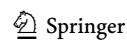

### **Declarations**

**Conflicts of interest** The authors have no conficts of interest to declare that are relevant to the content of this article.

## **References**

- Bae, G. Y. (2021). Neural evidence for categorical biases in location and orientation representations in a working memory task. *NeuroImage, 240*, Article 118366.
- Bae, G. Y., & Luck, S. J. (2017). Interactions between visual working memory representations. *Attention, Perception, & Psychophysics, 79*(8), 2376–2395.
- Bae, G. Y., & Luck, S. J. (2019). Reactivation of previous experiences in a working memory task. *Psychological Science, 30*(4), 587–595.
- Bae, G. Y., & Luck, S. J. (2020). Serial dependence in vision: Merely encoding the previous-trial target is not enough. *Psychonomic Bulletin & Review*, *27*(2), 293–300.
- Bae, G. Y., Olkkonen, M., Allred, S. R., Wilson, C., & Flombaum, J. I. (2014). Stimulus-specifc variability in color working memory with delayed estimation. *Journal of Vision, 14*(4), 7–7.
- Bae, G. Y., Olkkonen, M., Allred, S. R., & Flombaum, J. I. (2015). Why some colors appear more memorable than others: A model combining categories and particulars in color working memory. *Journal of Experimental Psychology: General, 144*(4), 744.
- Bliss, D. P., Sun, J. J., & D'Esposito, M. (2017). Serial dependence is absent at the time of perception but increases in visual working memory. *Scientifc Reports, 7*(1), 1–13.
- Brainard, D. H. (1997). The Psychophysics Toolbox. *Spatial Vision, 10*(4), 433–436.
- Chen, J., Leber, A. B., & Golomb, J. D. (2019). Attentional capture alters feature perception. *Journal of Experimental Psychology: Human Perception and Performance, 45*(11), Article 1443.
- Chunharas, C., Rademaker, R. L., Brady, T. F., & Serences, J. T. (2022). An adaptive perspective on visual working memory distortions. *Journal of Experimental Psychology: General*. [https://](https://doi.org/10.1037/xge0001191) [doi.org/10.1037/xge0001191](https://doi.org/10.1037/xge0001191)
- Collins, T. (2019). The perceptual continuity feld is retinotopic. *Scientifc Reports, 9*(1), 1–6.
- Faul, F., Erdfelder, E., Lang, A. G., & Buchner, A. (2007). G\* Power 3: A fexible statistical power analysis program for the social, behavioral, and biomedical sciences. *Behavior Research Methods, 39*(2), 175–191.
- Fischer, J., & Whitney, D. (2014). Serial dependence in visual perception. *Nature Neuroscience, 17*(5), 738–743.
- Fischer, C., Czoschke, S., Peters, B., Rahm, B., Kaiser, J., & Bledowski, C. (2020). Context information supports serial dependence of multiple visual objects across memory episodes. *Nature Communications, 11*(1), 1–11.
- Fukuda, K., Pereira, A. E., Saito, J. M., Tang, T. Y., Tsubomi, H., & Bae, G.-Y. (2022). Working memory content is distorted by its use in perceptual comparisons. *Psychological Science*, *33*(5), 816–829.
- Girshick, A. R., Landy, M. S., & Simoncelli, E. P. (2011). Cardinal rules: Visual orientation perception refects knowledge of environmental statistics. *Nature Neuroscience, 14*(7), 926–932.
- Golomb, J. D. (2015). Divided spatial attention and feature-mixing errors. *Attention, Perception, & Psychophysics*, *77*(8), 2562–2569.

- Golomb, J. D., Kupitz, C. N., & Thiemann, C. T. (2014). The infuence of object location on identity: A "spatial congruency bias". *Journal of Experimental Psychology: General, 143*(6), 2262.
- Kang, M. S., Hong, S. W., Blake, R., & Woodman, G. F. (2011). Visual working memory contaminates perception. *Psychonomic Bulletin & Review, 18*(5), 860–869.
- Kiyonaga, A., Scimeca, J. M., Bliss, D. P., & Whitney, D. (2017). Serial dependence across perception, attention, and memory. *Trends in Cognitive Sciences, 21*(7), 493–497.
- Li, A. Y., Liang, J. C., Lee, A. C., & Barense, M. D. (2020). The validated circular shape space: Quantifying the visual similarity of shape. *Journal of Experimental Psychology: General, 149*(5), 949.
- Liberman, A., Fischer, J., & Whitney, D. (2014). Serial dependence in the perception of faces. *Current Biology, 24*(21), 2569–2574.
- Lorenc, E. S., Mallett, R., & Lewis-Peacock, J. A. (2021). Distraction in visual working memory: Resistance is not futile. *Trends in Cognitive Sciences, 25*(3), 228–239.
- Manassi, M., Kristjánsson, Á., & Whitney, D. (2019). Serial dependence in a simulated clinical visual search task. *Scientifc Reports, 9*(1), 1–10.
- Peirce, J. W. (2007). PsychoPy—Psychophysics software in Python. *Journal of Neuroscience Methods, 162*(1/2), 8–13.
- Rademaker, R. L., Bloem, I. M., De Weerd, P., & Sack, A. T. (2015). The impact of interference on short-term memory for visual orientation. *Journal of Experimental Psychology: Human Perception and Performance, 41*(6), 1650.
- Rademaker, R. L., Chunharas, C., & Serences, J. T. (2019). Coexisting representations of sensory and mnemonic information in human visual cortex. *Nature Neuroscience, 22*(8), 1336–1344.
- Rauber, H. J., & Treue, S. (1998). Reference repulsion when judging the direction of visual motion. *Perception, 27*(4), 393–402.
- Schacter, D. L., Guerin, S. A., & Jacques, P. L. S. (2011). Memory distortion: An adaptive perspective. *Trends in Cognitive Sciences, 15*(10), 467–474.
- Scotti, P. S., Hong, Y., Leber, A. B., & Golomb, J. D. (2021). Visual working memory items drift apart due to active, not passive, maintenance. *Journal of Experimental Psychology: General*, *150*(12), 2506–2524.
- Steblay, N. K., & Dysart, J. E. (2016). Repeated eyewitness identifcation procedures with the same suspect. *Journal of Applied Research in Memory and Cognition, 5*(3), 284–289.
- Sun, S. Z., Fidalgo, C., Barense, M. D., Lee, A. C., Cant, J. S., & Ferber, S. (2017). Erasing and blurring memories: The diferential impact of interference on separate aspects of forgetting. *Journal of Experimental Psychology: General, 146*(11), 1606.
- Teng, C., & Kravitz, D. J. (2019). Visual working memory directly alters perception. *Nature Human Behaviour, 3*(8), 827–836.
- Wei, X. X., & Stocker, A. A. (2015). A Bayesian observer model constrained by efcient coding can explain 'anti-Bayesian' percepts. *Nature Neuroscience, 18*(10), 1509.
- Wei, X. X., & Stocker, A. A. (2017). Lawful relation between perceptual bias and discriminability. *Proceedings of the National Academy of Sciences, 114*(38), 10244–10249.
- Wixted, J. T., Mickes, L., Dunn, J. C., Clark, S. E., & Wells, W. (2016). Estimating the reliability of eyewitness identifcations from police lineups. *Proceedings of the National Academy of Sciences, 113*(2), 304–309.
- Wixted, J. T., Mickes, L., & Fisher, R. P. (2018). Rethinking the reliability of eyewitness memory. *Perspectives on Psychological Science, 13*(3), 324–335.

**Publisher's note** Springer Nature remains neutral with regard to jurisdictional claims in published maps and institutional afliations.

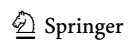