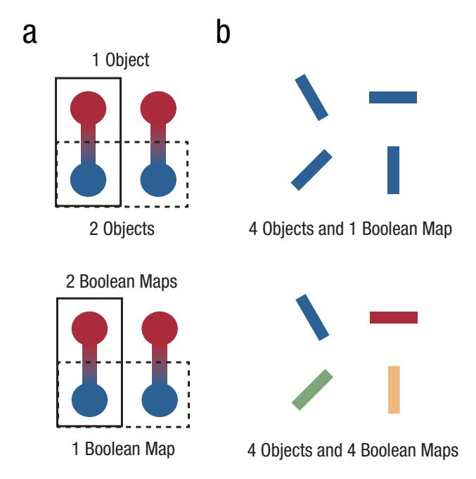
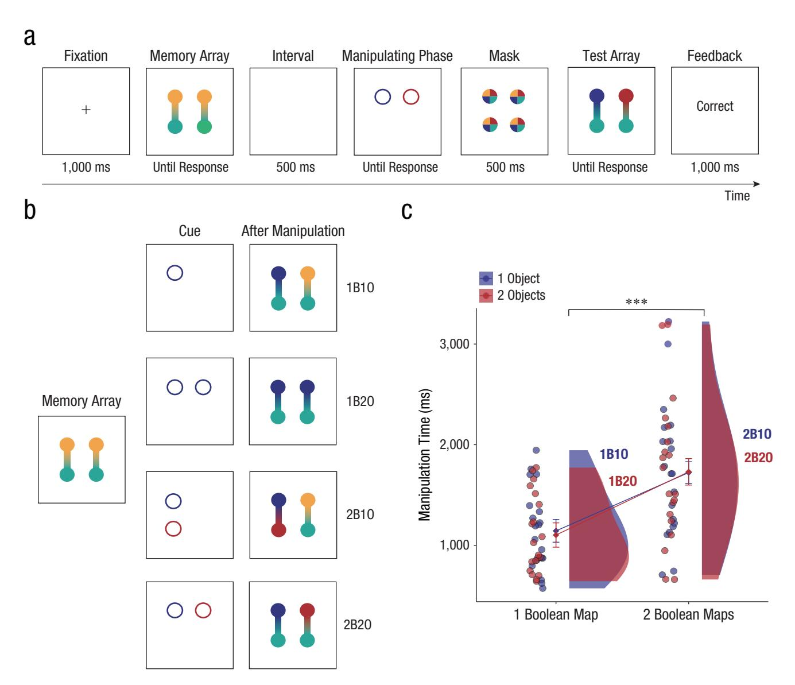
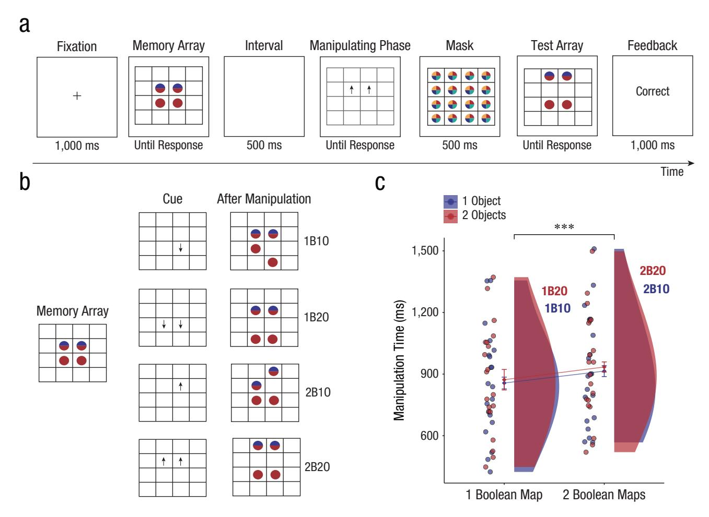
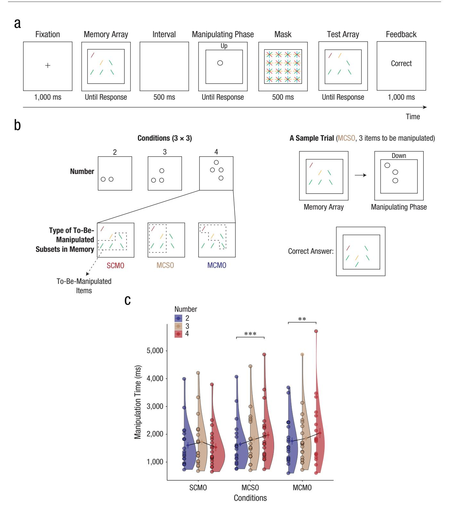
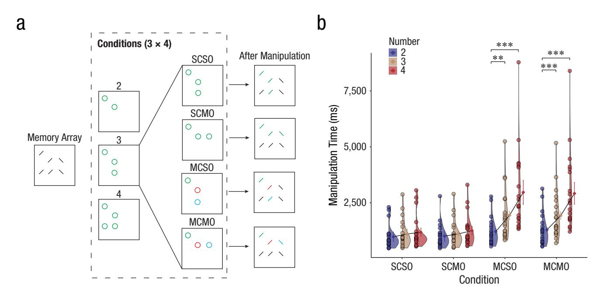

## The Basic Units of Working Memory Manipulation Are Boolean Maps, **Not Objects**

Huichao Ji1,2, Kaiyue Wang1, Garry Kong3, Xiaodan Zhang1, Wenzhen He1, and Xiaowei Ding1

1Department of Psychology, Guangdong Provincial Key Laboratory of Social Cognitive Neuroscience and Mental Health, Sun Yat-sen University; 2Department of Psychology, Yale University; and 3Waseda Institute of Advanced Study, Waseda University

Psychological Science 2024, Vol. 35(8) 887-899 © The Author(s) 2024 Article reuse guidelines: sagepub.com/journals-permissions DOI: 10.1177/09567976241257443 www.psychologicalscience.org/PS

#### Abstract

Determining the manipulation unit of working memory is one of the fundamental questions in understanding how working memory functions. The prevalent object-based theory in cognitive research predicts that memory manipulation is performed on the level of objects. Here we show instead that the basic units of working memory manipulation are Boolean maps, a data structure describing what can be perceived in an instant. We developed four new manipulation tasks (with data from 80 adults) and showed that manipulation times only increased when the number of Boolean maps manipulated increased. Increasing the number of orientations manipulated did not induce longer manipulation times, consistent with a key prediction of the Boolean map theory. Our results show that Boolean maps are the manipulation unit of working memory.

#### Keywords

working memory, manipulation, object, Boolean map, open data, open materials, preregistered

Received 11/17/23; Revision accepted 5/7/24

Human beings rely on working memory to temporarily store and manipulate information in the mind (A. Baddeley, 1992; Oberauer et al., 2018). Previous research has focused primarily on its storage aspect (Awh et al., 2007; Luck & Vogel, 1997, 2013). One often overlooked use for working memory, however, is the manipulation of information in the mind (A. D. Baddeley & Hitch, 1974).

## Working Memory Manipulation as a **Significant Executive Function**

Manipulating content in working memory is a fundamental ability of the human mind and has received significant attention in the past two decades. One prominent body in this field, supported by both behavioral and neural studies (e.g., Rose et al., 2016), focuses on internal attention when selective attention continues to operate and activate certain items (for a review, see Gazzaley & Nobre, 2012). And it has been shown that

top-down signals can continue to prioritize items maintained in working memory even when the objects are not visible anymore. Probably the best-known example is the retro-cuing effect, in which a cue provides information about the relevance of a given item for subsequent retrieval during working memory maintenance (for reviews, see Souza & Oberauer, 2016; van Ede & Nobre, 2023). These retro-cues trigger top-down modulation and improve working memory performance significantly by prioritizing the cued item (Williams & Woodman, 2012). As a result, working memory is distinguishable from short-term memory (for a review, see Superbia-Guimarães & Cowan, 2023).

Manipulation also helps organize the information not perceptually present (Davidson et al., 2006) and remove information in time to free up capacity, which benefits

#### **Corresponding Author:**

Xiaowei Ding, Sun Yat-sen University, Department of Psychology Email: dingxw3@mail.sysu.edu.cn

the future encoding of new information (Lewis-Peacock et al., 2018). It also plays a key role in cognitive development (Crone et al., 2006). Despite the importance of the manipulation of working memory, it is one of the least understood aspects of working memory. To understand the manipulating nature of working memory and uncover how the mind operates, we must address one fundamental question concerning the format of the underlying representation on which that manipulating process depends. What is the basic manipulation unit of working memory?

## Object-Based Manipulation in Working Memory?

Most insight about the manipulation of working memory comes from research on working memory storage, as storage and manipulation are closely related processes (A. Baddeley, 1992; Mohr et al., 2006). Therefore, theories regarding the data format of information stored in working memory may also apply to questions about the unit of manipulation. One of the most prevalent theories is object theory: Researchers have found that participants can store integrated objects in working memory with little or no additional cost (Luck & Vogel, 1997), and they have suggested that the object is the elementary unit of working memory. This theory has received a lot of support from both behavioral (Awh et al., 2007) and neurophysiological studies (Ngiam et al., 2023). On the basis of this theory, researchers have also investigated other characteristics of working memory, such as its storage fidelity (Zhang & Luck, 2008) and capacity (Luck & Vogel, 2013). Given the support for object-based storage of information in working memory, an object-based manipulation process seems reasonable. Although there are no direct studies to support this, there is some tangential evidence. Studies on updating tasks (Garavan, 1998; Oberauer, 2002) have typically found that it takes less time to manipulate counts of the same object used on a previous trial than counts of a different object. However, since these studies were not created to address the question of the unit of manipulation, objects are often confounded by other factors, such as location.

## Boolean-Map-Based Manipulation in Working Memory?

Alternatively, Boolean map theory suggests that working memory might operate on the level of Boolean maps. Boolean map theory is one of the few theories that can specifically account for the absence of objectbased advantage in working memory recall performance for different-part color–color stimuli (Xu, 2002).

## Statement of Relevance

How do we manipulate and update the information stored in our minds when it is not visible anymore? This is a fundamental question that intrigues both cognitive psychologists and the public at large. Two important theories in visual cognition—*object theory* and *Boolean map theory*—have led to different predictions on this question in working memory. Object theory predicts that it takes longer to manipulate more objects, whereas Boolean map theory predicts that manipulating times only increase when more Boolean maps (independent of objects) are manipulated. Here, we provide evidence that the manipulation unit of working memory is the Boolean map, rather than objects. This may help us understand the nature of working memory and may increase our understanding of many areas related to working memory manipulation (e.g., the measurement of cognitive development).

According to Boolean map theory, one can typically only perceive either all objects containing a given feature value (e.g., the location of all red items; Fig. 1a)1 or the spatial locations of any number of items without access to the features (Huang, 2015a, 2020; Huang et al., 2007; Huang & Pashler, 2007). For example, one might perceive that the red, blue, and green items make a triangle without knowing which is which. It also appears that people can access both the location and orientation of any number of objects simultaneously (Fig. 1b; Huang, 2015a, 2020). As a theory of working memory storage, this theory is supported by recent empirical studies that found that the capacity of working memory was better associated with the number of Boolean maps than the number of objects (Huang, 2020; Shen et al., 2013). Furthermore, in a changedetection task with two probes, there was a greater performance advantage when the two probes shared the same features (e.g., two red circles) than when the two probes were parts of the same object but had different features (e.g., a dumbbell with a red end and a green end). This indicates that the Boolean map might provide a better account than objects do as the manipulation unit of working memory.

## The Current Study

To distinguish between these two hypotheses, we developed four manipulation tasks by asking participants to mentally manipulate a subset of stimuli in their working memory, either through a change in color

Fig. 1. The comparison between the object theory and the Boolean map theory. In (a) are shown different-part color-color stimuli; in (b) are shown orientation stimuli.

(Experiments 1 and 4) or location (Experiments 2 and 3). Participants memorized a set of stimuli and, after a delay, were given one or more cues. They were then asked to manipulate a specific subset of items in working memory matching those cues (see the Method section). We changed the number of objects and the number of Boolean maps manipulated in working memory. The key measure was manipulation time, which was measured from the onset of the cue until the participants' next response. This measure reliably reflects the cost of updating contents stored in working memory (Garavan, 1998; Kessler & Oberauer, 2014). It then becomes a useful measurement for studying working memory manipulation (e.g., Ecker et al., 2014; Kessler & Meiran, 2008; Lendínez et al., 2011). In the current study, we used visual cues to indicate the spatial location of items to be manipulated in working memory and thus removed the search component (Kong & Fougnie, 2019). Consequently, the manipulating time now indicates only the time to manipulate items stored in working memory. The results in Experiments 1 and 2 show that manipulation times increased when the number of Boolean maps manipulated increased, but not when the number of objects increased. In Experiments 3 and 4, we further adopted orientations as memorial stimuli and found that increasing the number of orientations manipulated did not induce longer manipulation times. These results are consistent with the orientation-processing advantage predicted by the *Boolean map theory*.

## Open Practices Statement

All data have been made publicly available via the Open Science Framework and can be accessed at [https://osf.io/g5xpn/?view\\_only=80991ee5cbbf419582](https://osf.io/g5xpn/?view_only=80991ee5cbbf4195820569cd3c6c93af) [0569cd3c6c93af.](https://osf.io/g5xpn/?view_only=80991ee5cbbf4195820569cd3c6c93af) The Supplemental Material available online provides additional information and analyses. The work was reviewed and approved by the Research Ethics Board of Sun Yat-sen University.

## Experiment 1: Dyeing Multicolored Objects

In Experiment 1 we used dumbbell stimuli with different colored ends, and participants were cued to dye the dumbbell ends (Fig. 2a). Here, an object (O) is defined as a single dumbbell and a Boolean map (B) is defined as dumbbell ends of the same color. Cued items would span one Boolean map and one object (1B1O), one Boolean map and two objects (1B2O), two Boolean maps and one object (2B1O), or two Boolean maps and two objects (2B2O) in working memory (Fig. 2b). If the manipulation unit of working memory is the object, then increasing the number of objects to be manipulated should increase the manipulation time (2B2O = 1B2O > 2B1O = 1B1O). Alternatively, if the unit of manipulation of working memory is the Boolean map, increasing the number of Boolean maps to be manipulated would affect manipulation time (2B2O = 2B1O > 1B2O = 1B1O).

## *Method*

*Participants.* Twenty participants (11 females, *M*age = 20.5 years) from Sun Yat-sen University participated in Experiment 1. We ran a pilot study of Experiment 1 (with 10 people) and found an effect size of η2 = .18, Cohen's *d* = 0.87. To obtain 95% power (α = .05), we needed a sample size of 11, according to PANGEA (Power Analysis for General ANOVA designs; Westfall, 2015). Combining the results in the pilot study and previous work with a similar design (Experiment 4 in Kong & Fougnie, 2019), we further increased the sample size to 20 in all experiments to ensure the reliability of our experiment. Participants in the pilot studies were not included in formal experiments, and their data were discarded. All participants gave informed consent according to procedures approved by the Research Ethics Board of Sun Yat-sen University.

*Stimuli and apparatus.* Experiment 1 was created in MATLAB (2019b; The MathWorks, Natick, MA) with Psychophysics Toolbox extensions (3.0.16; Kleiner et al., 2007) and conducted using a Windows 7 (64-bit) desktop computer with a 27-in. LCD monitor (60 Hz of refresh

Fig. 2. Experimental design and results of Experiment 1. The procedure of Experiment 1 is illustrated in (a): Participants were asked to memorize a set of stimuli and mentally dye a subset of stimuli when the cue display was presented. They then reported whether the test array was identical to the representations in their mind after manipulation. The conditions in Experiment 1 are shown in (b). *1B1O* refers to cued items that would be represented as one Boolean map or one object, depending on the theory; *1B2O* refers to one Boolean map or two objects; *2B1O* refers to two Boolean maps or one object; and *2B2O* refers to two Boolean maps or two objects. Results of Experiment 1 are shown in (c). Error bars represent 95% confidence intervals with between-subjects variance removed (O'Brien & Cousineau, 2014); dots represent individual scores. \*\*\**p* < .001.

rate) and a standard QWERTY keyboard. The computer was in a dark laboratory room with acoustic shielding, and the monitor was placed 57 cm away from the participant.

Each memory item was a dumbbell-like item (horizontal or vertical, 50% trials for each) filled with two colors (radius 1°, distance to screen center 2.83°) with a gradient in the middle (length 5°, width 0.1°). There were seven colors for cues (radius 1°, width 0.1°) with RGB values as follows: red (255, 0, 0), green (0, 255, 0), blue (0, 0, 255), pink (250, 150, 200), yellow (255, 255, 0), cyan (0, 255, 255), and dark cyan (0, 100, 100).

*Procedure.* A trial began with a 1,000-ms fixation. Participants were then shown the memory array and instructed to press the space key when they had memorized the stimuli. After the key was pressed, there was a blank screen for 500 ms before the cue was presented. A location cue was chosen, to eliminate the search component of the task (i.e., there was no ambiguity as to which item was required to be moved). Participants were asked to mentally manipulate the cued stimuli and press the space key when they had completed the manipulation. The time between the onset of the cue and participants' key press (manipulation time) is thus an objective measure of difficulty. After a 500-ms mask, they completed a change-detection task to indicate whether the test array was identical to the stimuli after manipulation.

For the change-detection task, correct trials (50%) consisted of a correctly manipulated display. In incorrect trials, the colors of the same end of the dumbbells were exchanged. If two ends on the same side were in the same color after manipulation, both could be changed to another color at the same time, or if one end contains two different colors, they would be changed into two other different colors. Participants were instructed to press the "D" key if this second array was correctly manipulated and the "K" key if it was not. After the key was pressed, feedback was presented for 1,000 ms. There were 224 trials in Experiment 1 with 56 trials for each condition.

#### Results

Consistent with the Boolean map theory, manipulating more Boolean maps induced longer manipulation times: 2B1O (M = 1,722 ms, SE = 150.26) = 2B2O (M =1,730 ms, SE = 157.60) > 1B1O (M = 1,143 ms, SE = 157.60) 90.03) = 1B2O (M = 1,102 ms, SE = 86.27; see Fig. 2c); a repeated-measures analysis of variance (ANOVA) found a main effect of Boolean map, F(1, 19) = 46.40, p < .001,  $\eta_p^2 = .71$ ; a main effect of object, F(1, 19) =0.32, p = .578,  $\eta_p^2 = .02$ ; and an interaction effect,  $F(1, \frac{1}{2})$ 19) = 0.67, p = .423,  $\eta_p^2 = .03$  (see Table S1 in the Supplemental Material for full analyses). The overall average accuracy was 91.5% (SE = 0.02), indicating that participants were doing the task as instructed (see Fig. S1 in the Supplemental Material). We found no evidence of a speed-accuracy trade-off because we only found a significant effect of the number of Boolean maps where the accuracy of manipulating fewer Boolean maps was higher ( $M_{1B} = 93.8\%$ ,  $M_{2B} = 89.2\%$ ,), F(1, 19)= 14.16, p = .001,  $\eta_p^2 = .43$ .

During the test array, participants were slower to respond when more Boolean maps were manipulated  $(M_{\rm one}=682~{\rm ms},\,M_{\rm two}=993~{\rm ms}),\,F(1,\,19)=72.30,\,p<.001,\,\eta_p^2=.79.$  This is in line with and therefore not a confound for the primary effect on manipulating times. Additionally, participants were faster to respond when fewer objects were manipulated  $(M_{\rm one}=923~{\rm ms},\,M_{\rm two}=753~{\rm ms}),\,F(1,\,19)=12.30,\,p=.002,\,\eta_p^2=.39.$  The interaction effect was significant,  $F(1,\,19)=1.30,\,p=.268,\,\eta_p^2=.06.$  To better examine the two hypotheses, we analyzed the magnitude of the set-size effect for objects and Boolean maps. Post hoc tests with Bonferroni correction confirmed that the response times across four conditions were more consistent with the predictions of Boolean map theory (see Table S2).

# **Experiment 2: Moving Multicolored Objects**

To ensure external validity, we repeated the experiment using a different style of stimulus (colored circles) and a different manipulation task (location on a grid; Fig. 3a) in Experiment 2.

#### Method

**Participants.** A new set of 20 participants (13 females,  $M_{\text{age}} = 20.6$  years) were recruited from Sun Yat-sen University.

**Stimuli and apparatus.** Four circles (radius  $0.8^{\circ}$ ) were symmetrically and closely presented in a  $4 \times 4$  grid (length of each cell  $2.5^{\circ}$ , width  $0.1^{\circ}$ ). Two colors were selected for each memory display. Two of the four circles were in the same color, and the other two circles contained two semicircles with different colors in each (the color of one semicircle was the same as that of the two single-color circles). The apparatus was identical to Experiment 1.

**Procedure.** The procedure was identical to that of Experiment 1, except as noted. For the change-detection task, on incorrect displays, the two colors of the two-color circles were swapped (25%), or the color of the single-color circles was changed to another color (25%). There were 256 trials in Experiment 2 and 64 trials for each condition (Fig. 3b).

#### Results

The results of Experiment 2 were in line with Experiment 1 and the Boolean map theory: Manipulating more Boolean maps induced longer manipulation times: 2B1O (M = 915 ms, SE = 60.13) = 2B2O (M = 935 ms, SE = 58.22) > 1B1O (M = 857 ms, SE = 58.25) = 1B2O (M = 873 ms, SE = 58.81; see Fig. 3c); a repeatedmeasures ANOVA found a main effect of Boolean map,  $F(1, 19) = 16.42, p < .001, \eta_p^2 = .46$ ; a main effect of object, F(1, 19) = 1.00, p = .330,  $\eta_p^2 = .05$ ; and an interaction effect, F(1, 19) = 0.02, p = .903,  $\eta_b^2 < .001$  (see Table S3 in the Supplemental Material for post hoc tests with Bonferroni correction). The overall average accuracy was 94.6% (SE = 0.01), indicating that participants were doing the task as instructed (see Fig. S2). We found no evidence of a speed-accuracy trade-off, as there was no significant effect: main effect of the number of Boolean maps—F(1, 19) = 0.85, p = .368, $\eta_b^2 = .04$ ; main effect of the number of objects: F(1, 19) =0.18, p = .674,  $\eta_p^2 = .01$ ; interaction effect: F(1, 19) = $2.46, p = .134, \eta_p^{P_2} = .12.$ 

892 | | | | | | | | | | | | | | | | | | |

**Fig. 3.** Experimental design and results of Experiment 2. The procedure of Experiment 2 is illustrated in (a). Participants were asked to memorize a set of stimuli and mentally move a subset of stimuli indicated by the subsequent cue. They then reported whether the test array was identical to the representations in their mind after manipulation. Conditions in Experiment 2 are shown in (b). The results of Experiment 2 are shown in (c). Error bars represent 95% confidence intervals with between-subjects variance removed (O'Brien & Cousineau, 2014); dots represent individual scores. \*\*\*p < .001.

During the test array, participants were also slower to respond when more Boolean maps were manipulated ( $M_{\rm one}=1,282$  ms,  $M_{\rm two}=1,426$  ms),  $F(1,19)=29.20, p<.001, \eta_p^2=.61$ . This is in line with, and therefore not a confound for, the primary effect on manipulating times. Neither the main effect of the number of objects ( $M_{\rm one}=1,364$  ms,  $M_{\rm two}=1,344$  ms),  $F(1,19)=0.29, p=.595, \eta_p^2=.02$ , nor the interaction effect,  $F(1,19)=0.002, p=.963, \eta_p^2<.001$ , was significant.

The results of Experiments 1 and 2 have demonstrated that manipulation times of items in memory vary as a function of the number of features involved, not objects. But Boolean map theory is not, it appears, the only approach that can account for these results. First, in both experiments, participants may assign "pointers" or create somewhat arbitrary objects, depending on the task demands (e.g., Balaban & Luria, 2016a, 2016b; Thyer et al., 2022). For example, participants can

voluntarily group items with the same color (Gestalt information, Diaz et al., 2021; Peterson et al., 2015; Rabbitt et al., 2017) to a single pointer, so the patterns of the results are solely based on the number of unique colors to be remembered. Similarly, one body of feature-based theories in working memory suggested that feature values from a perceptual object are maintained separately (for a review, see Ngiam, 2023). Indeed, researchers have suggested a feature-selective manipulation in working memory in which people's accuracy was higher for the same object when detecting updated features than nonupdated features (Ko & Seiffert, 2009).

The next experiments will demonstrate that not only does a feature-based theory describe the manipulation unit of working memory better, but it is specifically the Boolean map formulation of it that describes this best. In Experiments 3 and 4, we asked participants to manipulate multiple orientations in the same color (one

Boolean map, or multiple feature values) or multiple colors in the same orientation (multiple Boolean maps or multiple feature values) to investigate whether this unique status of orientation manifests when manipulating items in working memory.

## **Experiment 3: Moving Multiple Orientations**

The Boolean map theory has a key distinction from a feature-based account in its prediction of orientation processing. The basic idea of Boolean map theory is that a mechanism encodes the spatial locations of a set of stimuli as one map. It suggests that in tasks that rely on spatial-structure information (e.g., change-detection tasks), bar orientations have a higher spatial strength (i.e., how well a stimulus can be represented as spatial structure) and can be processed as a spatial structure arbitrarily defined by two points (Huang, 2015b; Huang et al., 2007). Consistent with this idea, participants represent multiple bar orientations as a whole map and increase their memory capacity in change-detection tasks (Huang, 2015a, 2020). Therefore, Boolean map theory predicts that we manipulate multiple orientations simultaneously, whereas the pointer and featurebased account mentioned above would predict a sequential manipulation of orientations, similar to the manipulation of colors and shapes. This idea was supported by previous work finding that people were equally good at grouping bars with similar and dissimilar orientations (Nothdurft, 1993).

In Experiment 3, we used a memory array composed of colored and orientated lines. A subset of these (two/three/four) was cued for movement, as in Experiment 2 (Fig. 4a). Three types of subsets were used, consisting of items with (a) a single color and multiple orientations (SCMO, baseline condition), (b) a single orientation and multiple colors (MCSO), or (c) multiple colors and orientations (MCMO). Thus, there were 3 (manipulated items: 2/3/4) × 3 (3 types of subsets) different conditions (Fig. 4b). The Boolean map theory predicts that manipulation times will not change with the number of manipulated items in the SCMO condition.

#### Method

**Participants.** Twenty participants (14 females,  $M_{\text{age}} = 21.3$  years) were recruited from Sun Yat-sen University. We ran a pilot study (10 people) of Experiment 3 and found an effect size of  $\eta^2 = .06$ , Cohen's d = 0.50, on the basis of the interaction effect. To obtain 95% power ( $\alpha = .05$ ), we needed a sample size of 19. We increased the sample size to 20 to ensure the reliability of our experiment.

Stimuli and apparatus. In Experiment 3, six bars were shown in a 4 × 4 grid (length of each cell 2.5°, width of the grid bar 0.1°) in three colors (red, green, blue) and two orientations (45° clockwise from vertical or 45° counterclockwise from vertical). The features of each bar were chosen such that all three subsets could be created from them-four bars with the same color but different orientations, four bars with different colors and the same orientation, or four bars with different colors and different orientations in each memory display (a sample display: 45° red, 45° red, -45° red, -45° red, 45° green, 45° blue). The apparatus was identical to that of Experiment 1. The masking stimulus is updated on every trial to contain the memorized color. The four bars stayed close to each other so the contour formed by the four bars was not disrupted by other bars.

**Procedure.** The procedure was identical to Experiment 1's, except as noted. For the change-detection task, on incorrect displays, the color or orientation of one of the cued items was changed. There were 216 trials in Experiment 3 with 24 trials for each condition.

#### Results

Results were in line with the Boolean map theory showing that manipulating multiple orientated lines was faster than for multiple colors (Fig. 4c)—repeated-measures ANOVA, main effect of number, F(2, 38) = 8.35, p < .001,  $\eta_{p}^{2} = .31$ ; main effect of subset types, F(2, 38) =19.01, p < .001,  $\eta_p^2 = .50$ ; interaction effect, F(4, 76) = 6.89, p < .001,  $\eta_p^2 = .27$  (see Table S4 in the Supplemental Material for post hoc tests with Bonferroni correction). The interaction effect was driven by a lack of difference in SCMO conditions, 2SCMO (M = 1,604 ms, SE =177.29) = 3SCMO (M = 1,726 ms, SE = 201.09) = 4SCMO (M = 1,532 ms, SE = 164.37; no significant pairwise)comparisons, lowest p = .299). In comparison, manipulating more colored lines with the same orientation (MCSO) induced longer manipulation times—2MCSO: (M = 1,644 ms, SE = 188.69), 3MCSO: (M = 1,819 ms,SE = 199.85), 4MCSO: (M = 1,974 ms, SE = 223.75). There were no significant pairwise differences between consecutive set sizes, but 2MCSO was significantly faster than 4MCSO, t(19) = -4.57, p < .001. Furthermore, a similar pattern was observed when increasing both the number of cued colors and orientations—2MCMO: (M =1,757 ms, SE = 184.00), 3MCMO: (M = 1,851 ms, SE =215.57), 4MCMO: (M = 2,046 ms, SE = 258.27). Importantly, the rate of increase in manipulation times was the same in the MCSO and MSMO conditions: 4MCSO-2MCSO versus 4MCMO-2MCMO, t(19) = 0.45, p = .657. (See Table S4 for full analyses.) The overall average

Fig. 4. Experimental design and results of Experiment 3. The procedure of Experiment 3 is illustrated in (a); conditions in Experiment 3 (manipulating phase) are illustrated in (b). *SCMO* refers to single color and multiple orientations; MCSO refers to multiple colors and single orientation; MCMO refers to multiple colors and multiple orientations. The items in dashed boxes are the to-be-manipulated items during the manipulating phase. Results of Experiment 3 are shown in (c). Error bars represent 95% confidence intervals with betweensubjects variance removed (O'Brien & Cousineau, 2014); dots represent individual scores. \*\**p* < .01. \*\*\**p* < .001.

**Fig. 5.** Experimental design and results of Experiment 4. Conditions in Experiment 4 are illustrated in (a). *SCSO* refers to single color and single orientation; *SCMO* refers to single color and multiple orientations; MCSO refers to multiple colors and single orientation; MCMO refers to multiple colors and multiple orientations. Results in Experiment 3 are shown in (b). Error bars represent 95% confidence intervals with between-subjects variance removed (O'Brien & Cousineau, 2014); dots represent individual scores. \*\*p < .01. \*\*\*p < .001.

accuracy was 79.8% (SE = 0.02), indicating that participants were doing the task as instructed (see Fig. S3). There was no evidence of a speed-accuracy trade-off, and no differences were significant; the main effect of number of subsets was F(2, 38) = 0.74, p = .486,  $\eta_p^2 = .04$ ; the main effect of types of subsets was F(2, 38) = 2.35, p = .109,  $\eta_p^2 = .11$ ; the interaction effect was F(4, 76) = 1.72, p = .155,  $\eta_p^2 = .08$ .

During the test array, the main effect of types of subsets was significant— $M_{\rm SCMO}=2,205~{\rm ms},~M_{\rm MCSO}=2,361~{\rm ms},~M_{\rm MCMO}=2,530~{\rm ms},~F(2,~38)=14.70,~p<.001,~\eta_p^2=.44.$  The main effect of number of subsets was not significant,  $M_{\rm two}=2,345~{\rm ms},~M_{\rm three}=2,400~{\rm ms},~M_{\rm four}=2,349~{\rm ms},~F(2,~38)=1.07,~p=.355,~\eta_p^2=.05.$  The interaction effect was significant,  $F(4,~76)=3.59,~p=.010,~\eta_p^2=.16.$  Further analysis showed that this is in line with, and therefore not a confound for, the primary effect on manipulating times (see detailed results in Table S5).

#### **Experiment 4: Dyeing Multiple Orientations**

As before, to ensure external validity, Experiment 3 was repeated using a different stimulus and manipulation task. In Experiment 4, participants were presented with black-oriented lines and asked to dye a subset of these (Fig. 5a; also see Fig. S4 in the supplemental material for the experimental procedure). Importantly, orientation was now presented in the encoding phase, whereas color was presented in the manipulation phase, which

allowed the introduction of another baseline condition in which the subset included only a single orientation and single color (SCSO; Fig. 5b).

#### Method

**Participants.** A new set of 20 participants (12 females,  $M_{\text{age}} = 20.0$  years) were recruited from Sun Yat-sen University.

**Stimuli and apparatus.** In Experiment 4, all stimuli were shown in black (RGB values 0, 0, 0) on a gray (127, 127, 127) background. Bars were either 45° clockwise from vertical or 45° counterclockwise from vertical with a length of 1.6° and a width of 0.2°. The grid was made up of lines with a length of 10° and a width of 0.1°. The radius of the circular cue was 0.8°. The apparatus was identical to that of Experiment 1.

**Procedure.** The procedure was identical to Experiment 1's, except as noted. For the change-detection task, on incorrect displays, the color or orientation of one of the items was changed. There were 384 trials in Experiment 4 with 32 trials for each condition.

#### Results

Results were in line with the results of Experiment 3 (Fig. 5c): A repeated-measures ANOVA found a main

896 | | | | | | | | | | | | | | | | | | |

effect of number, F(2, 38) = 37.76, p < .001,  $\eta_p^2 = .67$ ; a main effect of subset types, F(3, 57) = 28.85, p < .001,  $\eta_p^2 = .60$ ; an interaction effect, F(6, 114) = 28.48, p < 0.001,  $\eta_p^2$  = .60 (see Table S6 for post hoc tests with Bonferroni correction). No differences were observed in the SCSO conditions, as participants could use a mimicking strategy to manipulate orientations in the same color: 2SCSO (M = 977 ms, SE = 120.49) = 3SCSO (M = 1,103 ms, SE = 141.09) = 4SCSO (M = 1,180 ms,SE = 163.69; no significant pairwise comparisons, all ps = 1.000). Mentally dyeing more items did not induce longer manipulation times when increasing orientations, 2SCMO (M = 1,009 ms, SE = 119.68) = 3SCMO (M = 1,106 ms, SE = 138.22) = 4SCMO (M = 1,251 ms,SE = 158.24; no significant pairwise comparison, all ps = 1.000; see Fig. 4c and Table S6). However, when dyeing orientations of different colors, dyeing more items induced longer manipulation times, 2MCSO (M =1,210 ms, SE = 138.36) < 3MCSO (M = 1,935 ms, SE = 1,210 ms253.47) < 4MCSO (M = 2,966 ms, SE = 403.73; all pairwise comparisons were significant, all ps < .001; see Fig. 4c and Table S6). This increase was also observed when we increased both the number of cued colors and orientations, 2MCMO (M = 1,289 ms, SE = 159.55) < 3MCMO (M = 1,923 ms, SE = 243.94) < 4MCMO (M =2,917 ms, SE = 387.87; all pairwise comparisons were significant, highest p = .003). Importantly, the rate of increase in manipulation times was the same in the MCSO and MSMO conditions (4MCSO-2MCSO vs. 4MCMO-2MCMO), t(19) = -1.10, p = .283.

The overall average accuracy was 91.0% (SE = 0.01). indicating that participants were doing the task as instructed (see Fig. S5). We found no evidence of a speed-accuracy trade-off, as accuracy followed the same pattern as for manipulation times. The main effect of the number of subsets was significant, F(2, 38) =11.71, p < .001,  $\eta_p^2 = .38$ . Participants' accuracy was lower when manipulating more items—post hoc tests with Bonferroni correction,  $M_{\text{two}} = 92.7\%$ ,  $M_{\text{three}} = 91.0\%$ ,  $M_{\rm four}$  = 89.3%,  $M_{\rm two}$  >  $M_{\rm four}$  95% confidence interval (CI) = [0.02, 0.05], p < .001. The main effect of types of subsets was also significant, F(3, 57) = 10.52, p < .001,  $\eta_p^2 =$ .36. Participants were most accurate under the SCSO condition (post hoc tests with Bonferroni correction,  $M_{\text{SCSO}} = 94.6\%$ ,  $M_{\text{SCMO}} = 90.5\%$ ,  $M_{\text{MCSO}} = 90.5\%$ ,  $M_{\text{MCMO}} =$ 88.3%,  $M_{SCSO} > M_{SCMO} = M_{MCSO} = M_{MCMO}$ , ps < .05). The interaction effect was not significant, F(6, 114) = 1.03, p = .407,  $\eta_p^2 = .05$ .

During the test array, the main effect of the number of subsets was significant, F(2, 38) = 31.73, p < .001,  $\eta_p^2 = .63$ . Participants were faster to make a response after manipulating more items (post hoc tests with Bonferroni correction,  $M_{\rm two} = 1,843$  ms,  $M_{\rm three} = 2,016$  ms,  $M_{\rm four} = 2,154$  ms,  $M_{\rm two} < M_{\rm three} < M_{\rm four}$ , ps < .01). The

main effect of types of subsets was also significant, F(3, 57) = 39.39, p < .001,  $\eta_p^2 = .68$  (post hoc tests with Bonferroni correction:  $M_{\rm SCSO} = 1,768$  ms,  $M_{\rm SCMO} = 1,883$  ms,  $M_{\rm MCSO} = 2,107$  ms,  $M_{\rm MCMO} = 2,260$  ms,  $M_{\rm SCSO} = M_{\rm SCMO} < M_{\rm MCSO} < M_{\rm MCMO}$ ;  $p_{\rm SCSO-SCMO} = .15$ , all other ps < .05). The interaction effect was significant, F(6, 114) = 13.58, p < .001,  $\eta_p^2 = .42$ . Further analysis showed that this is in line with, and therefore not a confound for, the primary effect on manipulating times (see detailed results in Table S7).

#### **General Discussion**

The current study investigated the question of whether the working process of working memory occurs on the same level as the memory part. We did this by investigating whether manipulation of working memory worked on the level of Boolean maps, just as information seems to be stored in Boolean maps (Huang, 2020). Given that the variation in the number of Boolean maps best described changes to manipulation times, it appears that storage and manipulation happen on the same data format, making it likely that the two are closely related processes of working memory (A. Baddeley, 1992). This is further supported by neuroscientific data which shows that the dorsal premotor areas and a part of the ventral areas support both maintenance and manipulation of visual information in working memory (Mohr et al., 2006).

Boolean map theory has traditionally been used to describe visual attention, but the increasing evidence that it can also accurately describe working memory may compel us to reevaluate past research and question our assumptions about vision. Objects have long been taken as the elementary units of cognitive processes, from object-based attention (Scholl et al., 2001) to numerous theories and models of working memory (Luck & Vogel, 1997; Zhang & Luck, 2008). Later studies have clarified that two processes in visual attention (Duncan, 1980a, 1980b)—selection and access—process information in different formats. That research indicated that the object is only the unit of selection, an unconscious process involving the rejection of distractors. However, Boolean map-based selection explains access in visual attention better than object-based theories (Huang, 2010). The same appears to be the case in working memory: Boolean-map-based storage (Huang, 2020) describes working memory better than objectbased views, as it is one of a few theories that can specifically account for the absence of an object-based advantage in working memory's recall performance for stimuli made up of different colored parts (Xu, 2002).

Beyond object-based attention, there is also a large body of research supporting a feature-based selection in visual processing (e.g., Maunsell & Treue, 2006; Moore & Egeth, 1998; Wolfe, 1994; Zhang & Luck, 2009). However, there are several key differences between feature-based attention and Boolean map theory: First, feature-based attention does not account for the processing advantage for multiple orientations (i.e., it would predict that both different orientations with the same color and different colors with the same orientation could benefit from grouping without top-down cues toward a specific dimension). Second, to our knowledge, feature-based theory has not been applied to working memory manipulation. And the results of our study suggested that people were faster to manipulate items with multiple orientations and a single color (i.e., SCMO) than items with multiple colors and a single orientation (i.e., MCSO). Therefore, we provide new evidence supporting a Boolean-map-based manipulation in working memory. These studies together suggest that many processes commonly thought of as objectbased processes or feature-based processes may instead be better described as Boolean-map-based processes. Future research should reevaluate the data format of other processes in visual cognition.

It is important to note, however, that our finding that the manipulation and storage of visual working memory happening on the same level does not mean that the two processes are entirely the same. Indeed, there is ample evidence that the two processes are separate and distinct. For example, children diagnosed with autism spectrum disorders show impaired performance on a Black Span Backward task (a working memory manipulation task; Joseph et al., 2005) but show no such deficit on the n-back task (a working memory storage and selection task; Koshino et al., 2008). Besides, researchers found that the costs of working memory storage and working memory manipulation are independent (Pailian & Halberda, 2013). Participants' memory performance declined when storing more items, indicating that there is a storage limit of three to four items. When participants were asked to mentally swap these stored items, their performance declined more when the number of swaps increased. Further research into the degree to which these processes are related will help determine the cause of these differences and therefore reveal much about the underlying processes involved.

## *Constraints on generality*

There remain several open questions about the degree to which the present results could be generalized in other ways.

All the participants in this project were college students. However, previous research has shown that mental manipulation abilities may vary among different cultures (e.g., Janssen & Geiser, 2012). Future work could thus further explore working memory manipulations in the format of Boolean maps in different populations.

Similarly, future work could also explore how the effects in the current project may or may not generalize to real-world objects. We include only simple shapes and features here; it remains unknown whether we can also take complicated objects and operate them in the same way.

## *Conclusion*

To sum up, we adopted four manipulating tasks and found that manipulating more Boolean maps (multiple colors) induced longer manipulation times (Experiments 1 and 2). We further found that simultaneous manipulation of multiple orientations is possible, as they constitute one Boolean map (Experiments 3 and 4). These findings suggest that the manipulation unit of working memory is the Boolean map.

### Transparency

*Action Editor:* Krishnankutty Sathian

*Editor:* Patricia J. Bauer

*Author Contributions*

Huichao Ji: Conceptualization; Formal analysis; Investigation; Methodology; Visualization; Writing – original draft; Writing – review & editing.

Kaiyue Wang: Conceptualization; Data curation; Formal analysis; Investigation; Methodology; Writing – original draft.

Garry Kong: Conceptualization; Investigation; Methodology; Writing – original draft.

Xiaodan Zhang: Conceptualization; Data curation; Investigation; Writing – original draft.

Wenzhen He: Conceptualization; Investigation; Writing – original draft.

Xiaowei Ding: Conceptualization; Funding acquisition; Resources; Supervision; Validation; Writing – original draft; Writing – review & editing.

*Declaration of Conflicting Interests*

The author(s) declared that there were no conflicts of interest with respect to the authorship or the publication of this article.

*Open Practices*

All data have been made publicly available via the Open Science Framework and can be accessed at [https://osf.io/](https://osf.io/g5xpn/?view_only=80991ee5cbbf4195820569cd3c6c93af) [g5xpn/?view\\_only=80991ee5cbbf4195820569cd3c6c93af.](https://osf.io/g5xpn/?view_only=80991ee5cbbf4195820569cd3c6c93af) The Supplemental Material available online provides additional information and analyses. This article has received the badges for Open Data, Open Materials, and Preregistration. More information about the Open Practices badges can be found at [http://www.psychologicalscience.org/](http://www.psychologicalscience.org/publications/badges) [publications/badges](http://www.psychologicalscience.org/publications/badges)

#### ORCID iDs

Huichao Ji <https://orcid.org/0000-0001-8425-526X> Kaiyue Wang <https://orcid.org/0000-0002-4745-7767> Garry Kong <https://orcid.org/0000-0002-6832-8016> Xiaowei Ding <https://orcid.org/0000-0002-0583-291X>

#### Acknowledgments

This research was supported by grants from the National Natural Science Foundation of China (Grant No. 32271103), the Natural Science Foundation of Guangdong Province (Grant No. 2023A1515011762), the Guangzhou Science and Technology Plan Project – Leading Elite Program (Grant No. 2024A04J3301), and Japan Society for the Promotion of Science (JSPS) Kakenhi (Grant No. JP21K20306).

#### Supplemental Material

Additional supporting information can be found at [http://](http://journals.sagepub.com/doi/suppl/10.1177/09567976241257443) [journals.sagepub.com/doi/suppl/10.1177/09567976241257443](http://journals.sagepub.com/doi/suppl/10.1177/09567976241257443)

#### Note

1. This is similar to "Gestalt grouping by similarity." However, grouping cannot explain the absence of object-based advantage for different-part color-color stimuli, where the advantage of grouping by connectedness should be observed. Therefore, we would not consider it as a possible hypothesis here. (For more discussion about grouping and Boolean map theory, see Huang, 2020.)

#### References

- Awh, E., Barton, B., & Vogel, E. K. (2007). Visual working memory represents a fixed number of items regardless of complexity. *Psychological Science*, *18*(7), 622–628.
- Baddeley, A. (1992). Working memory. *Science*, *255*(5044), 556–559.
- Baddeley, A. D., & Hitch, G. (1974). Working memory. In G. H. Bower (Ed.), *Psychology of learning and motivation* (Vol. 8, pp. 47–89). Elsevier.
- Balaban, H., & Luria, R. (2016a). Integration of distinct objects in visual working memory depends on strong objecthood cues even for different-dimension conjunctions. *Cerebral Cortex*, *26*(5), 2093–2104.
- Balaban, H., & Luria, R. (2016b). Object representations in visual working memory change according to the task context. *Cortex*, *81*, 1–13.
- Crone, E. A., Wendelken, C., Donohue, S., van Leijenhorst, L., & Bunge, S. A. (2006). Neurocognitive development of the ability to manipulate information in working memory. *Proceedings of the National Academy of Sciences, USA*, *103*(24), 9315–9320.
- Davidson, M. C., Amso, D., Anderson, L. C., & Diamond, A. (2006). Development of cognitive control and executive functions from 4 to 13 years: Evidence from manipulations of memory, inhibition, and task switching. *Neuropsychologia*, *44*(11), 2037–2078.
- Diaz, G. K., Vogel, E. K., & Awh, E. (2021). Perceptual grouping reveals distinct roles for sustained slow wave activity

- and alpha oscillations in working memory. *Journal of Cognitive Neuroscience*, *33*(7), 1354–1364.
- Duncan, J. (1980a). The demonstration of capacity limitation. *Cognitive Psychology*, *12*(1), 75–96.
- Duncan, J. (1980b). The locus of interference in the perception of simultaneous stimuli. *Psychological Review*, *87*(3), 272–300.
- Ecker, U. K., Lewandowsky, S., & Oberauer, K. (2014). Removal of information from working memory: A specific updating process. *Journal of Memory and Language*, *74*, 77–90.
- Garavan, H. (1998). Serial attention within working memory. *Memory & Cognition*, *26*(2), 263–276.
- Gazzaley, A., & Nobre, A. C. (2012). Top-down modulation: Bridging selective attention and working memory. *Trends in Cognitive Sciences*, *16*(2), 129–135.
- Huang, L. (2010). What is the unit of visual attention? Object for selection, but Boolean map for access. *Journal of Experimental Psychology: General*, *139*(1), 162–179.
- Huang, L. (2015a). Color is processed less efficiently than orientation in change detection but more efficiently in visual search. *Psychological Science*, *26*(5), 646–652.
- Huang, L. (2015b). Visual features for perception, attention, and working memory: Toward a three-factor framework. *Cognition*, *145*, 43–52.
- Huang, L. (2020). Unit of visual working memory: A Boolean map provides a better account than an object does. *Journal of Experimental Psychology: General*, *149*(1), 1–30.
- Huang, L., & Pashler, H. (2007). A Boolean map theory of visual attention. *Psychological Review*, *114*(3), 599–631.
- Huang, L., Treisman, A., & Pashler, H. (2007). Characterizing the limits of human visual awareness. *Science*, *317*(5839), 823–825.
- Janssen, A. B., & Geiser, C. (2012). Cross-cultural differences in spatial abilities and solution strategies—An investigation in Cambodia and Germany. *Journal of Cross-Cultural Psychology*, *43*(4), 533–557.
- Joseph, R. M., McGrath, L. M., & Tager-Flusberg, H. (2005). Executive dysfunction and its relation to language ability in verbal school-age children with autism. *Developmental Neuropsychology*, *27*(3), 361–378.
- Kessler, Y., & Meiran, N. (2008). Two dissociable updating processes in working memory. *Journal of Experimental Psychology: Learning, Memory, and Cognition*, *34*(6), 1339–1348.
- Kessler, Y., & Oberauer, K. (2014). Working memory updating latency reflects the cost of switching between maintenance and updating modes of operation. *Journal of Experimental Psychology: Learning, Memory, and Cognition*, *40*(3), 738–754.
- Kleiner, M., Brainard, D., & Pelli, D. (2007). What's new in Psychtoolbox-3. *Perception*, *36*, 1.
- Ko, P. C., & Seiffert, A. E. (2009). Updating objects in visual short-term memory is feature selective. *Memory & Cognition*, *37*, 909–923.
- Kong, G., & Fougnie, D. (2019). Visual search within working memory. *Journal of Experimental Psychology: General*, *148*(10), 1688–1700.

- Koshino, H., Kana, R. K., Keller, T. A., Cherkassky, V. L., Minshew, N. J., & Just, M. A. (2008). fMRI investigation of working memory for faces in autism: Visual coding and underconnectivity with frontal areas. *Cerebral Cortex*, *18*(2), 289–300.
- Lendínez, C., Pelegrina, S., & Lechuga, T. (2011). The distance effect in numerical memory-updating tasks. *Memory & Cognition*, *39*, 675–685.
- Lewis-Peacock, J. A., Kessler, Y., & Oberauer, K. (2018). The removal of information from working memory. *Annals of the New York Academy of Sciences*, *1424*(1), 33–44.
- Luck, S. J., & Vogel, E. K. (1997). The capacity of visual working memory for features and conjunctions. *Nature*, *390*(6657), 279–281.
- Luck, S. J., & Vogel, E. K. (2013). Visual working memory capacity: From psychophysics and neurobiology to individual differences. *Trends in Cognitive Sciences*, *17*(8), 391–400.
- Maunsell, J. H., & Treue, S. (2006). Feature-based attention in visual cortex. *Trends in Neurosciences*, *29*(6), 317–322.
- Mohr, H. M., Goebel, R., & Linden, D. E. (2006). Content- and task-specific dissociations of frontal activity during maintenance and manipulation in visual working memory. *Journal of Neuroscience*, *26*(17), 4465–4471.
- Moore, C. M., & Egeth, H. (1998). How does feature-based attention affect visual processing? *Journal of Experimental Psychology: Human Perception and Performance*, *24*(4), 1296–1310.
- Ngiam, W. X. Q. (2024). Mapping visual working memory models to a theoretical framework. *Psychonomic Bulletin & Review*, *31*, 442–459.
- Ngiam, W. X. Q., Loetscher, K. B., & Awh, E. (2023). Objectbased encoding constrains storage in visual working memory. *Journal of Experimental Psychology: General*. Advanced online publication.
- Nothdurft, H. C. (1993). The role of features in preattentive vision: Comparison of orientation, motion and color cues. *Vision Research*, *33*(14), 1937–1958.
- Oberauer, K. (2002). Access to information in working memory: Exploring the focus of attention. *Journal of Experimental Psychology: Learning Memory and Cognition*, *28*(3), 411–421.
- Oberauer, K., Lewandowsky, S., Awh, E., Brown, G. D. A., Conway, A., Cowan, N., Donkin, C., Farrell, S., Hitch, G. J., Hurlstone, M. J., Ma, W. J., Morey, C. C., Nee, D. E., Schweppe, J., Vergauwe, E., & Ward, G. (2018). Benchmarks for models of short-term and working memory. *Psychological Bulletin*, *144*(9), 885–958.
- O'Brien, F., & Cousineau, D. (2014). Representing error bars in within-subject designs in typical software packages. *The Quantitative Methods for Psychology*, *10*(1), 56–67.
- Pailian, H., & Halberda, J. (2013). Independent costs for storing and manipulating information in visual working memory. *Visual Cognition*, *21*(6), 704–707.

- Peterson, D. J., Gözenman, F., Arciniega, H., & Berryhill, M. E. (2015). Contralateral delay activity tracks the influence of Gestalt grouping principles on active visual working memory representations. *Attention, Perception, & Psychophysics*, *77*, 2270–2283.
- Rabbitt, L. R., Roberts, D. M., McDonald, C. G., & Peterson, M. S. (2017). Neural activity reveals perceptual grouping in working memory. *International Journal of Psychophysiology*, *113*, 40–45.
- Rose, N. S., LaRocque, J. J., Riggall, A. C., Gosseries, O., Starrett, M. J., Meyering, E. E., & Postle, B. R. (2016). Reactivation of latent working memories with transcranial magnetic stimulation. *Science*, *354*(6316), 1136–1139.
- Scholl, B. J., Pylyshyn, Z. W., & Feldman, J. (2001). What is a visual object? Evidence from target merging in multiple object tracking. *Cognition*, *80*(1–2), 159–177.
- Shen, M., Yu, W., Xu, X., & Gao, Z. (2013). Building blocks of visual working memory: Objects or Boolean maps? *Journal of Cognitive Neuroscience*, *25*(5), 743–753.
- Souza, A. S., & Oberauer, K. (2016). In search of the focus of attention in working memory: 13 years of the retrocue effect. *Attention, Perception, & Psychophysics*, *78*, 1839–1860.
- Superbia-Guimarães, L., & Cowan, N. (2023). Disentangling processing and storage accounts of working memory development in childhood. *Developmental Review*, *69*, Article 101089.
- Thyer, W., Adam, K. C., Diaz, G. K., Velázquez Sánchez, I. N., Vogel, E. K., & Awh, E. (2022). Storage in visual working memory recruits a content-independent pointer system. *Psychological Science*, *33*(10), 1680–1694.
- van Ede, F., & Nobre, A. C. (2023). Turning attention inside out: How working memory serves behavior. *Annual Review of Psychology*, *74*, 137–165.
- Westfall, J. (2015). *PANGEA: Power analysis for general ANOVA designs* [Unpublished manuscript]. Available at <https://osf.io/x5dc3/download>
- Williams, M., & Woodman, G. F. (2012). Directed forgetting and directed remembering in visual working memory. *Journal of Experimental Psychology: Learning, Memory, and Cognition*, *38*(5), 1206–1220.
- Wolfe, J. M. (1994). Guided search 2.0: A revised model of visual search. *Psychonomic Bulletin & Review*, *1*, 202–238.
- Xu, Y. (2002). Limitations of object-based feature encoding in visual short-term memory. *Journal of Experimental Psychology: Human Perception and Performance*, *28*(2), 458–468.
- Zhang, W., & Luck, S. J. (2008). Discrete fixed-resolution representations in visual working memory. *Nature*, *453*(7192), 233–235.
- Zhang, W., & Luck, S. J. (2009). Feature-based attention modulates feedforward visual processing. *Nature Neuroscience*, *12*(1), 24–25.