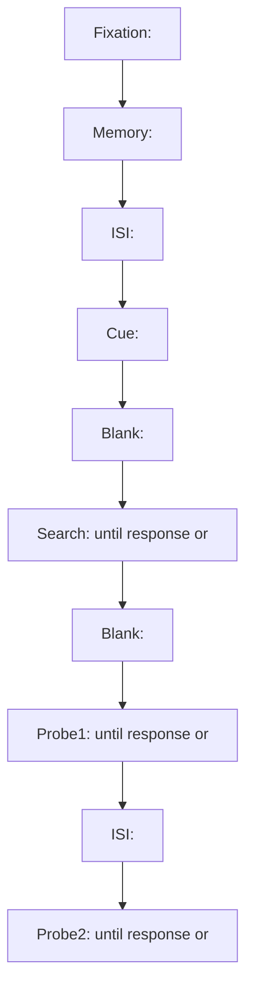

# exp_design.md — <PAPER_TITLE>

> Purpose: formal, unambiguous, evidence-auditable design spec for reproduction.
> Hard constraint: all stimulus geometry & rendering must be expressible with **stimkit** primitives and conventions.

## 0. Evidence Index (唯一引用入口)

> Rule: all later sections cite **Evidence IDs** only (E-...). No naked paths in正文.

| Evidence ID | Source Type | Path | Locator | What it supports |
|---|---|---|---|---|
| E-P1 | paper | paper/paper.md | <#page-x-y or section heading> | timing / apparatus / procedure |
| E-F1 | figure | paper/<figure_file> | Fig.<n> | geometry / layout inference |
| E-D1 | data_doc | data/<README.md> | <section> | field semantics / encoding |
| E-C1 | code | data/<reproduce_stimuli.py> | L<start>-L<end> | rendering logic / randomization |
| E-K1 | config | data/<stimuli_config.toml> | [<section>] | param registry defaults |
| E-S1 | stimkit | <stimkit path> | <file + lines> | coordinate/angle conventions |

---

## 0.1 Precedence Policy (冲突处理原则)

When multiple sources disagree, log the conflict and choose an implementation truth.
Default adjudication order (may be overridden with explicit rationale):
1) paper text  2) figure geometry  3) data docs/schema  4) reference code/config  5) derived inference

---

## 0.2 Conflict Log (如无冲突，保留为空表)

| Conflict ID | What disagrees | Evidence | Decision | Rationale | Impacted sections |
|---|---|---|---|---|---|
| C-0001 | <short description> | E-P1 vs E-C1 | <chosen truth> | <why> | <where> |

---

## 0.3 Missing Items (缺失项清单；缺失≠猜测)

| Missing Item | Why needed | Blocks which section | Required evidence to resolve |
|---|---|---|---|
| M-0001 | <e.g., angle zero direction in stimkit> | Global Conventions | E-S1 (stimkit) |

---

## 1. Global Conventions (全局约定；必须可实现)

### 1.1 Units
- Visual angle unit: deg (visual degrees), unless explicitly stated otherwise. [Evidence: <E-...>]
- Pixel unit: px only used when tied to canvas resolution or line width. [Evidence: <E-...>]

### 1.2 Coordinate System (stimkit binding)
> This section must be grounded in stimkit evidence (E-S*). If missing, mark MISSING and stop any dependent derivations.

- Origin (0,0): <...> [Evidence: E-S1]
- +x direction: <...> [Evidence: E-S1]
- +y direction: <...> [Evidence: E-S1]
- angle=0 axis: <...> [Evidence: E-S1]
- positive rotation direction: <CW/CCW> [Evidence: E-S1]

### 1.3 Canvas / Display
| Param Key | Type | Unit | Value/Range | Source (Evidence ID) | Notes |
|---|---|---|---|---|---|
| canvas.screen_distance | float | cm | <...> | E-P1 / E-K1 |  |
| canvas.screen_size | float | inch | <...> | E-P1 / E-K1 |  |
| canvas.screen_resolution | int[2] | px | <...> | E-P1 / E-K1 |  |
| canvas.bg_color | enum/rgb | - | <...> | E-P1 / E-K1 |  |
| display.refresh_rate | float | Hz | <... or MISSING> | E-P1 |  |

### 1.4 Color Palette
| Color Name | RGB | Where used | Source |
|---|---:|---|---|
| <name> | (<r>,<g>,<b>) | <phase/stimulus> | <E-...> |

---

## 2. Parameter Registry (参数注册表；代码实现的单一真源)

> Rule: every numeric parameter must appear here (or be explicitly marked MISSING and listed above).

| Param Key | Type | Unit | Value/Range | Used in | Source (Evidence ID) | Notes |
|---|---|---|---|---|---|---|
| trial.fixation_ms | int | ms | <...> | Exp*/TrialFlow | E-P1 |  |
| trial.memory_ms | int | ms | <...> | Exp*/TrialFlow | E-P1 |  |
| trial.isi_ms | int | ms | <...> | Exp*/TrialFlow | E-P1 |  |
| trial.cue_ms | int | ms | <...> | Exp*/TrialFlow | E-P1 |  |
| trial.search_timeout_ms | int | ms | <...> | Exp*/TrialFlow | E-P1 |  |
| trial.post_search_blank_ms | int | ms | <...> | Exp*/TrialFlow | E-P1 |  |
| trial.probe_timeout_ms | int | ms | <...> | Exp*/TrialFlow | E-P1 |  |
| search.array_n | int | - | <...> | Search phase | E-P1 / E-C1 |  |
| search.radius_deg | float | deg | <...> | Search phase | E-P1 / E-K1 |  |
| search.item_diam_deg | float | deg | <...> | Search phase | E-P1 / E-K1 |  |

---

## 3. Fact Ledger (事实台账；最小可复现原子事实)

Status ∈ {confirmed, inferred, missing, conflict}

| Fact ID | Statement (unambiguous) | Source (Evidence ID) | Status | Derivation (if inferred/conflict) |
|---|---|---|---|---|
| F-0001 | <single-sentence fact> | <E-...> | confirmed | - |
| F-0002 | <single-sentence fact> | <single-sentence fact> | inferred | <explain exactly how inferred> |
| F-0003 | <single-sentence fact> | <E-...> | missing | <why it is missing> |

---

# 4. Experiments

> For each experiment, repeat the same structure.
> All stimuli specs must be realizable with stimkit primitives.

---

## 4.1 Experiment 1 — <EXP1_SHORT_NAME>

### 4.1.1 Design Summary (implementation-relevant only)
- Groups (between-subject): <...> [Evidence: <E-...>]
- Within-trial factors: <...> [Evidence: <E-...>]
- Response devices/keys: <...> [Evidence: <E-...>]
- Trial counts / blocks / practice: <...> [Evidence: <E-...>]
- Exclusion criteria (only if it affects data filtering needed for replication scripts): <...> [Evidence: <E-...>]

### 4.1.2 Variables & Levels (枚举必须明确)
| Variable | Scope | Levels (exact) | Encoded by (data field?) | Evidence |
|---|---|---|---|---|
| group | between | {Integrated, Separate} | data/groups folder or field | E-D1 / E-K1 |
| cue_val | within | {1,2} meaning=<...> | cue_val | E-D1 |
| dist_cond | within | {1,2,3,4} meaning=<...> | dist_cond | E-D1 |

### 4.1.3 Trial State Machine (Mermaid; include duration & gate)

### 4.1.4 Phase Table (可直接转成实现)
| phase_id | duration_ms | terminates_on | gate (condition) | scene_id | records |
|---|---:|---|---|---|---|
| Fixation | <...> | timeout | - | S-EXP1-FIX | <fields> |
| Memory | <...> | timeout | group==Integrated | S-EXP1-MEM-INT | <fields> |
| Memory | <...> | timeout | group==Separate | S-EXP1-MEM-SEP | <fields> |
| Search | <...> | response/timeout | - | S-EXP1-SEARCH | <fields> |
| Probe1 | <...> | response/timeout | - | S-EXP1-PROBE1 | <fields> |
| Probe2 | <...> | response/timeout | - | S-EXP1-PROBE2 | <fields> |

---

## 5. Stimulus Library (stimkit-realizable scene specs)

> Each scene is a pure spec: primitives + bindings + evidence.
> All geometry must be unambiguous without seeing the figure.

### Scene S-EXP1-FIX
**Evidence:** <E-...>

**Primitives (stimkit):**
1) primitive_id: P-FIX-01
   - kind: <...>
   - pos_deg: (<x>, <y>)
   - size: <...>
   - stroke: <color_name or rgb>
   - fill: <color_name or rgb>
   - rotation_deg: <... or 0>
   - z_index: <int>
   - bindings: <none or derived vars>

**Notes:** <...>

### Scene S-EXP1-SEARCH
**Evidence:** <E-P...> and/or <E-F...>

**Derived Vars used:**
| var | definition | evidence |
|---|---|---|
| target_pos_idx | <...> | <E-...> |

**Primitives (stimkit):**
1) primitive_id: P-SEARCH-ITEM-*
   - kind: <...>
   - pos_deg: (<...>)
   - size: <...>
   - fill: <...>
   - rotation_deg: <...>
   - z_index: <...>
   - bindings:
     - pos_deg <- pos_table[target_pos_idx]
     - fill <- target_color

**Constraints:**
- <e.g., singleton_pos_idx != target_pos_idx> [Evidence: <E-...>]

---

## 6. Data Dictionary

| Column/Field | Type | Range | Meaning | Experiment-specific? | Source (Evidence ID) |
|---|---|---|---|---|---|
| <field> | <int/float/str> | <...> | <...> | <Yes/No> | <E-D1> |

---

## 7. Data ↔ Implementation Mapping (闭环映射)

### 7.1 Data → Derived
| Data Field | Condition | Derived Var | Formula/Rule | Evidence |
|---|---|---|---|---|
| <field> | <gate> | <var> | <rule> | <E-...> |

### 7.2 Derived → Render (stimkit)
| Derived Var | Used Phase | stimkit target | Param Key | Evidence |
|---|---|---|---|---|
| <var> | <phase> | <primitive_id>.<attr> | <param_key> | <E-...> |

---

## 8. Output Fields (what to record)

| Field | Type | How computed | Evidence |
|---|---|---|---|
| rt_ms | int | <...> | <E-...> |
| correct | bool | <...> | <E-...> |

---

## 9. Appendix: Minimal Reproduction Checklist (doc-only)

- Every numeric parameter appears in Parameter Registry with Evidence.
- Every phase appears in Mermaid + Phase Table.
- Every scene referenced in Phase Table has a Scene Spec.
- Every data field used in any rule appears in Data Dictionary and Mapping tables.
- All conflicts are logged; all missing items are enumerated.
